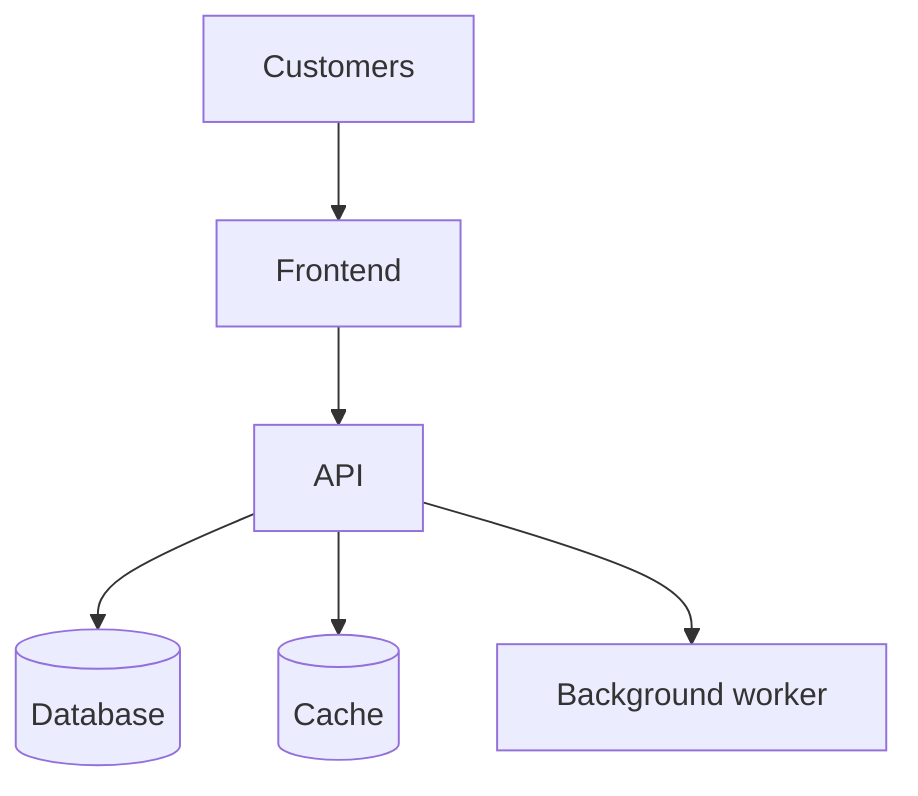

# Lesson 001 - From One Application to Many Containers

## Kubernetes Zero-to-Hero Course

**Stage:** 1 - Why Kubernetes Exists  
**Level:** Complete beginner  
**Estimated study time:** 90-120 minutes  
**Lab type:** Guided Docker lab and human-orchestrator simulation  
**Kubernetes commands used:** None

---

## 1. Overview

Before learning Kubernetes, you must first understand the problem that caused people to need it.

Imagine that you have one small web application running in one container. Managing it is easy:

```text
User -> Web container
```

You can start it, stop it, inspect it, and read its logs yourself.

But a real application may grow into several components:

- A frontend that shows pages to users
- An API that processes requests
- A database that stores information
- A cache that makes requests faster
- A background worker that handles slow jobs

Some components may also need several identical copies. For example, one API container may not be enough when thousands of users arrive.

Very quickly, one application can become dozens or hundreds of containers running across several servers.

This lesson asks one important question:

> What becomes difficult when humans must manage all those containers manually?

We will not solve the problem with Kubernetes yet. First, you will experience the problem yourself.

---

## 2. Learning Objectives

By the end of this lesson, you should be able to:

1. Explain the difference between an application, a component, a container, and a replica.
2. Explain why a real application may use several containers.
3. Explain why one component may need several identical replicas.
4. Manually run and inspect three replicas of a web container.
5. Identify the operational work created by scaling containers manually.
6. Explain why a container engine alone does not solve application-wide coordination.
7. Describe the kind of management system that becomes necessary at larger scale.

You do not need to know any Kubernetes object names in this lesson.

---

## 3. Prerequisites

You should have:

- An Ubuntu machine
- Docker installed and running
- Permission to use Docker
- Basic familiarity with `docker run`, `docker ps`, `docker logs`, and `docker rm`
- Basic knowledge of images, containers, ports, and processes

If Docker is not working, you can still complete the theory and paper challenge. Do not skip the lesson.

---

## 4. New Vocabulary

| Term | Easy meaning | Example |
|---|---|---|
| Application | The complete system used to provide a function | An online store |
| Component | One functional part of the application | Frontend, API, or database |
| Container | A running isolated instance of an image | One running Nginx container |
| Replica | Another copy of the same component | Three identical API containers |
| Scale out | Add more replicas | Change from one API container to three |
| Scale in | Remove replicas | Change from three API containers to one |
| Availability | Whether users can reach and use the application | The website still responds |
| Failure | A component stops working correctly | A container exits |
| Operator | A person or system that manages the application | A DevOps engineer |
| Orchestration | Coordinating many containers and the work around them | Placement, recovery, networking, and updates |

### Pronunciation Notes

- Kubernetes: `koo-ber-NET-eez`
- Container: `kun-TAY-ner`
- Replica: `REP-li-kuh`
- Orchestration: `or-kes-TRAY-shun`

---

## 5. The Story: TechCorp Shop

TechCorp launches a tiny online store.

At first, the application is one program running in one container:

```text
Customers -> shop container
```

The developer is happy. The DevOps engineer can manage it with a few Docker commands.

Then the store grows.

The team separates the system into components:



This is still one application: **TechCorp Shop**.

But it contains five components.

Later, the number of customers grows. One frontend and one API cannot handle the traffic. The team runs more copies:

| Component | Number of replicas |
|---|---:|
| Frontend | 3 |
| API | 5 |
| Database | 1 primary plus replicas |
| Cache | 3 |
| Worker | 4 |

The application now contains many running containers.

That creates a very different operational problem.

---

## 6. Foundation: Application, Component, Container, and Replica

These four words must not be mixed together.

### 6.1 Application

An application is the complete system that delivers value to the user.

For example, an online store may allow customers to:

- View products
- Add items to a cart
- Place orders
- Pay
- Track deliveries

All of that together is the application.

### 6.2 Component

A component is one part of the application with a specific responsibility.

For example:

```text
TechCorp Shop application
|-- Frontend component
|-- API component
|-- Database component
|-- Cache component
`-- Worker component
```

The frontend is not necessarily the whole application. It is one component of it.

### 6.3 Container

A container is one running instance of an image.

If the team has an image named:

```text
techcorp/shop-api:1.0
```

and starts it once, there is one API container.

### 6.4 Replica

A replica is another instance of the same component.

```text
API component
|-- api-1 container
|-- api-2 container
`-- api-3 container
```

The three containers are separate running instances, but they provide the same API function.

### 6.5 The Complete Relationship

```text
One application
  -> contains several components
     -> each component runs in one or more containers
        -> multiple copies of the same component are replicas
```

### Check Your Understanding

Suppose the TechCorp application has:

- 2 frontend containers
- 4 API containers
- 1 database container
- 3 worker containers

Answer before reading further:

1. How many applications are there?
2. How many component types are listed?
3. How many containers are running?
4. How many API replicas exist?

**Answers:** One application, four component types, ten containers, and four API replicas.

---

## 7. Why Use Multiple Containers?

Using multiple containers is not automatically better. It is useful when there is a clear reason.

### Reason 1 - Separate Responsibilities

The frontend displays pages. The API processes business logic. The database stores data.

Separating them can allow teams to update and scale them independently.

### Reason 2 - Different Resource Needs

The API may need more CPU. The database may need more memory and durable storage. The worker may need many short bursts of CPU.

### Reason 3 - Independent Releases

The frontend team may release version 2 without changing the database.

### Reason 4 - Failure Isolation

If a background worker crashes, the frontend might continue serving pages. This depends on good application design; containers do not guarantee it automatically.

### Reason 5 - Scaling

If the API is busy but the database is not, the team can add API replicas instead of duplicating every component.

### Important Warning

Do not split a simple program into many components only because microservices sound advanced.

More components also mean more:

- Network connections
- Configuration
- Logs
- Security boundaries
- Deployments
- Failures
- Operational work

Architecture should solve a real need.

---

## 8. Why Run Multiple Replicas?

There are two main beginner-level reasons.

### 8.1 More Capacity

Imagine one API container can handle 100 requests per second.

If the store receives 250 requests per second, one instance is not enough.

The team might run three replicas:

```text
               |-> API replica 1
Users -> Router|-> API replica 2
               `-> API replica 3
```

This is **horizontal scaling** or **scaling out**.

It does not guarantee exactly three times the performance. The database, network, locks, or application design may become bottlenecks.

### 8.2 Better Availability

If there is only one API container and it stops, the API is unavailable.

With several replicas, traffic may be sent to healthy copies while the failed one is repaired.

But simply starting three containers is not enough. Something must also:

- Know which containers are healthy
- Know their addresses
- Distribute traffic among them
- Stop sending traffic to unhealthy containers
- Start a replacement when one disappears

This is where manual management becomes painful.

---

## 9. The Manual Management Problem

Suppose you run 50 containers on 5 servers.

An operator must continually answer questions like these:

### Starting and Placement

- Which server has enough CPU and memory?
- Which server should run the new container?
- What happens when a server is full?
- Should replicas be placed on different servers?

### Failure Recovery

- Did the container stop?
- Did the application freeze while the container stayed running?
- Who notices the failure?
- Who starts a replacement?
- On which server should the replacement run?

### Networking

- What IP address does the new container have?
- How will other components find it?
- How will users reach several replicas through one stable address?
- How will traffic avoid failed replicas?

### Scaling

- How many replicas are currently running?
- How many should be running?
- When should more be added?
- When should unnecessary replicas be removed?

### Updates

- How do we replace version 1 with version 2?
- How do we avoid stopping every replica simultaneously?
- How do we detect a bad release?
- How do we return to the previous version?

### Configuration and Security

- Which containers need a database password?
- How do we change configuration consistently?
- Which component may communicate with which other component?

### Data

- What happens to important data when a container is replaced?
- Where is the storage located?
- Can the replacement container reach the correct data?

Docker can run containers. However, when an application grows, the wider problem is coordinating the desired behavior of all containers across the complete system.

---

## 10. Mental Model: The Restaurant

Imagine a restaurant with one cook and one order.

The owner can manage everything personally.

Now imagine:

- 20 cooks
- 10 waiters
- 200 customers
- Several kitchens
- Cooks sometimes becoming unavailable
- Orders changing every minute

The owner cannot stand beside every worker and manually coordinate every action.

A management system is needed to track:

- How many workers are required
- Which workers are available
- Where each worker should work
- Which orders are waiting
- Who replaces an unavailable worker

Containers are like the workers.

Container images describe what kind of worker can be created.

The servers are like the kitchens.

Kubernetes will eventually become the management system, but we are not opening that box yet.

---

## 11. Practical Scenario

You are the junior DevOps engineer at TechCorp.

The shop frontend currently has one container. Marketing announces a promotion, so your senior engineer asks you to run three identical frontend replicas.

For this beginner lab:

- Nginx represents the shop frontend.
- Each Nginx container represents one replica.
- Each replica uses a different host port because Docker cannot bind all three containers to the same host address and port.
- There is no load balancer in this lesson.
- You are responsible for noticing and repairing failures.

The inconvenience is intentional. The lab is designed to reveal the management problem.

---

## 12. Hands-on Lab - Become the Human Orchestrator

### Lab Goal

Maintain exactly three running web replicas manually.

### Desired State

Write this on paper before starting:

```text
Required frontend replicas: 3
Required image: nginx:alpine
Required status: running
Required host ports: 8081, 8082, 8083
```

This paper is your desired state. Docker does not read it. **You** must compare it with reality.

### Step 1 - Verify Docker

Before changing anything, verify that the Docker client can communicate with the daemon.

```console
hamad@Hamooda:~$ docker version
```

Then list running containers:

```console
hamad@Hamooda:~$ docker ps
```

Do not continue if Docker reports a daemon connection or socket permission error. That would be a separate problem.

### Step 2 - Check for Old Lab Containers

Collect evidence before creating containers:

```console
hamad@Hamooda:~$ docker ps -a --filter name=shop-web
```

If no rows appear below the headings, the names are available.

### Step 3 - Start the First Replica

Predict first:

- What will the container be named?
- Which host port will reach container port 80?
- Will it run in the foreground or background?

Now start it:

```console
hamad@Hamooda:~$ docker run -d \
  --name shop-web-1 \
  -p 8081:80 \
  nginx:alpine
```

Meaning:

| Part | Meaning |
|---|---|
| `docker run` | Create and start a container |
| `-d` | Run it in the background |
| `--name shop-web-1` | Give this instance a clear name |
| `-p 8081:80` | Host port 8081 forwards to container port 80 |
| `nginx:alpine` | Image used to create the container |

### Step 4 - Verify the First Replica

Do not assume that the start command means the application is healthy.

First inspect container state:

```console
hamad@Hamooda:~$ docker ps --filter name=shop-web-1
```

Then test the actual HTTP application:

```console
hamad@Hamooda:~$ curl -I http://127.0.0.1:8081
```

You should see an HTTP response containing a status such as:

```text
HTTP/1.1 200 OK
```

This gives stronger evidence than merely seeing the container in `docker ps`.

### Step 5 - Scale Out Manually

Marketing needs three replicas. Start the second:

```console
hamad@Hamooda:~$ docker run -d \
  --name shop-web-2 \
  -p 8082:80 \
  nginx:alpine
```

Start the third:

```console
hamad@Hamooda:~$ docker run -d \
  --name shop-web-3 \
  -p 8083:80 \
  nginx:alpine
```

You have manually scaled the frontend from one replica to three.

### Step 6 - Compare Desired and Actual State

Show only the relevant containers:

```console
hamad@Hamooda:~$ docker ps \
  --filter name=shop-web \
  --format 'table {{.Names}}\t{{.Status}}\t{{.Ports}}'
```

Expected shape:

```text
NAMES        STATUS         PORTS
shop-web-1   Up ...         0.0.0.0:8081->80/tcp
shop-web-2   Up ...         0.0.0.0:8082->80/tcp
shop-web-3   Up ...         0.0.0.0:8083->80/tcp
```

Compare the output with your paper:

```text
Desired replicas: 3
Actual running replicas: 3
Difference: 0
```

You have performed a manual reconciliation.

Do not worry about memorizing the word yet. It simply means comparing what you want with what exists and correcting the difference.

### Step 7 - Test Every Replica

```console
hamad@Hamooda:~$ curl -I http://127.0.0.1:8081
```

```console
hamad@Hamooda:~$ curl -I http://127.0.0.1:8082
```

```console
hamad@Hamooda:~$ curl -I http://127.0.0.1:8083
```

All three should answer.

### Stop and Think

You now have three replicas, but users do not have one stable application address. They must know about ports 8081, 8082, and 8083.

Ask yourself:

1. Which address should customers use?
2. Who decides which replica receives the next request?
3. What happens if requests continue going to a failed replica?
4. If you start replica 4, who tells clients about its new address?

Simply creating replicas does not solve traffic distribution.

---

## 13. Break-and-Repair Exercise

### The Failure

Another operator accidentally stops replica 2:

```console
hamad@Hamooda:~$ docker stop shop-web-2
```

Do not repair it immediately.

### Question 1 - Does Docker Automatically Restore Three Replicas?

Wait a few seconds, then inspect:

```console
hamad@Hamooda:~$ docker ps \
  --filter name=shop-web \
  --format 'table {{.Names}}\t{{.Status}}\t{{.Ports}}'
```

Only two running replicas should appear.

Why?

Because you used Docker to start three independent containers, but you did not give any higher-level system the rule:

```text
Always keep three frontend replicas running.
```

Your paper contains the desired state, but the computer is not continuously enforcing it.

### Question 2 - Is the Missing Container Deleted?

Running `docker ps` shows only running containers. Inspect all matching containers:

```console
hamad@Hamooda:~$ docker ps -a \
  --filter name=shop-web \
  --format 'table {{.Names}}\t{{.Status}}'
```

You should see `shop-web-2` in an exited state.

### Repair

You determine that the container was deliberately stopped and its configuration is still correct. Start the same container again:

```console
hamad@Hamooda:~$ docker start shop-web-2
```

### Verify the Repair

Check the replica count and status:

```console
hamad@Hamooda:~$ docker ps \
  --filter name=shop-web \
  --format 'table {{.Names}}\t{{.Status}}\t{{.Ports}}'
```

Then test the repaired application instance:

```console
hamad@Hamooda:~$ curl -I http://127.0.0.1:8082
```

The repair is complete only after both checks succeed.

### What Did You Actually Do?

You manually performed five operator actions:

1. Remembered the desired number was three.
2. Inspected the actual number.
3. Detected a difference.
4. Corrected the difference.
5. Verified that actual state matched desired state again.

For three containers, this is easy.

For 3,000 containers across many servers, a human cannot perform this loop quickly and reliably every second.

---

## 14. A More Difficult Failure

Stopping a container is easy to detect because it disappears from `docker ps`.

But imagine that the container remains running while the application inside it becomes stuck.

```text
Container state: running
Application state: not answering requests
```

`docker ps` alone may look normal.

Now the operator needs a better question:

> Is the application healthy and ready to receive traffic?

This is an important distinction:

| Question | Evidence |
|---|---|
| Is the container process running? | Container state |
| Is the application responding correctly? | Application-level check such as HTTP |

That is why the lab used both `docker ps` and `curl`.

Later, Kubernetes will learn how to use health information, but this lesson only establishes why that information is necessary.

---

## 15. Scaling Creates More Than a Counting Problem

At first, scaling appears simple:

```text
Need more capacity -> start more containers
```

But each new replica creates additional questions.

### Example

You need five API replicas across three servers:

| Server | Free CPU | Free memory | Existing API replicas |
|---|---:|---:|---:|
| server-a | 1 CPU | 2 GiB | 2 |
| server-b | 4 CPU | 8 GiB | 1 |
| server-c | 2 CPU | 4 GiB | 0 |

Where should the next two replicas run?

A good decision may consider:

- Available resources
- Avoiding too many replicas on one server
- Required storage
- Network location
- Hardware requirements
- Maintenance status

Then server-b fails. Every container on it disappears at once.

The operator must:

1. Detect the server failure.
2. Identify the lost containers.
3. Find capacity elsewhere.
4. Start replacements.
5. update traffic routing.
6. Verify application health.

This is no longer only a Docker command problem. It is a continuous system-management problem.

---

## 16. What Kind of System Do We Need?

Do not memorize Kubernetes features yet. Reason from the problem.

An effective management system should let the operator say what is required, such as:

```text
I want three healthy frontend replicas.
```

The system should then continuously:

1. Observe what is currently running.
2. Compare actual state with required state.
3. Start or remove instances when the count differs.
4. Find suitable servers for new instances.
5. Provide a stable way to reach changing instances.
6. avoid sending traffic to instances that are not ready.
7. coordinate updates and recovery.

The official Kubernetes overview describes this wider need: production containers must be managed, replaced after failure, scaled, and made reachable reliably. Kubernetes provides a platform for managing containerized workloads and services through declarative configuration and automation.

But remember:

> Kubernetes does not create the need for complexity. The distributed application already has the complexity. Kubernetes gives us a consistent system for managing it.

---

## 17. Interactive Paper Simulation - Human Orchestrator

This simulation requires no software.

### Available Servers

```text
server-a capacity: 4 containers
server-b capacity: 4 containers
server-c capacity: 4 containers
```

### Desired Application

```text
Frontend replicas: 3
API replicas: 3
Worker replicas: 2
Database replicas: 1
```

### Round 1 - Placement

Place all nine containers across the three servers.

Rules:

- No server may exceed four containers.
- Try not to place every replica of one component on the same server.

Write your answer before continuing.

### Round 2 - Failure

`server-b` fails.

Answer:

1. Which containers were lost?
2. How many replicas remain for each component?
3. Is there enough capacity on the remaining servers?
4. Which replicas should be restored first?
5. What happens to user traffic during your decision?

### Round 3 - Traffic Increase

Marketing now requires five API replicas instead of three.

Answer:

1. Where will the two new replicas run?
2. Can the remaining servers hold them?
3. Do you need another server?
4. How will clients discover the new replicas?

### Lesson from the Simulation

You must keep a complete model in your head:

- Desired counts
- Actual counts
- Server capacity
- Placement
- Failures
- Network destinations

A machine can observe and compare these states continuously. A human cannot do it reliably at large scale.

---

## 18. Independent Challenge

### Scenario

TechCorp wants four web replicas instead of three.

### Your Mission

Without copying the exact command from the guided steps:

1. Start `shop-web-4` from `nginx:alpine`.
2. Publish it on host port `8084` and container port `80`.
3. Prove that all four matching containers are running.
4. Prove that replica 4 returns an HTTP response.
5. Stop any one replica.
6. Detect which replica is not running.
7. Restore the required count of four.
8. Verify the repaired replica at the application level.

### Acceptance Criteria

Your challenge is complete only if:

- `docker ps` shows four running `shop-web-*` containers.
- Ports 8081, 8082, 8083, and 8084 are published correctly.
- All four HTTP checks succeed.
- You can explain why Docker did not independently enforce the count of four.
- You can describe your evidence before and after repair.

### Senior Question

Your senior engineer asks:

> If I request ten replicas tomorrow, what other problem must we solve besides starting seven more containers?

A strong answer mentions several of these:

- Server capacity and placement
- Stable discovery
- Load balancing
- Health checking
- Failure replacement
- Consistent configuration
- Safe updates
- Monitoring

---

## 19. Common Mistakes

### Mistake 1 - Thinking one container always equals one application

A complete application may contain many components and containers.

### Mistake 2 - Thinking multiple components and multiple replicas are the same idea

They are different:

- Frontend and API are different components.
- `api-1` and `api-2` are replicas of the same component.

### Mistake 3 - Assuming three running containers automatically share traffic

Replicas need a traffic-distribution and discovery mechanism. Starting copies alone does not create one stable entry point.

### Mistake 4 - Assuming a running container means a healthy application

The main process may exist while the application is stuck or unable to serve requests.

### Mistake 5 - Thinking Kubernetes is needed for every container

One small container on one machine may be managed perfectly well without Kubernetes. Kubernetes becomes valuable when coordination, automation, availability, scaling, and consistent operations justify its complexity.

### Mistake 6 - Believing more replicas always solve performance problems

Another component, such as the database, may be the bottleneck. Some workloads also cannot safely run as identical replicas without special design.

### Mistake 7 - Repairing before collecting evidence

If you restart immediately, you may restore service but destroy useful clues. First inspect state, application response, logs, and recent changes when time permits.

---

## 20. Best Practices Introduced in This Lesson

1. Define the required state clearly.
2. Give container instances meaningful names in manual labs.
3. Inspect before changing.
4. Verify both process state and application behavior.
5. Separate application components according to real operational needs.
6. Do not depend on one replica when availability requirements demand redundancy.
7. Keep important data outside a disposable container lifecycle.
8. Automate repeated coordination when manual work becomes unreliable.
9. Treat scaling as a networking, capacity, and health problem, not only a replica-count problem.
10. Verify every recovery action.

---

## 21. Interview Questions

### Question 1

**Why may a production application use multiple containers?**

Different components may have separate responsibilities, dependencies, release cycles, resource needs, or scaling requirements.

### Question 2

**What is a replica?**

A replica is another running instance of the same application component.

### Question 3

**What is horizontal scaling?**

Horizontal scaling means adding more instances or replicas instead of only making one instance larger.

### Question 4

**Why is manually starting three containers not a complete availability solution?**

Nothing necessarily monitors health, restores the required count, discovers new addresses, or prevents traffic from reaching failed instances.

### Question 5

**What is desired state?**

Desired state describes what we want the system to look like, such as three healthy frontend replicas.

### Question 6

**What is actual state?**

Actual state is what currently exists, such as only two running replicas because one failed.

### Question 7

**What does reconciliation mean in simple language?**

It means comparing actual state with desired state and making changes to reduce the difference.

### Question 8

**Does Kubernetes replace Docker in every sense?**

No. Kubernetes manages containerized workloads across machines. Containers still require a compatible container runtime. Kubernetes and a container engine solve different layers of the problem.

---

## 22. Lesson Reflection

Answer these without looking back:

1. Explain application, component, container, and replica using the TechCorp shop.
2. Why did we use different host ports for the three Docker containers?
3. After `shop-web-2` stopped, why did it stay stopped?
4. Why did we use both `docker ps` and `curl`?
5. What manual actions did you perform to return from two replicas to three?
6. What additional problems appear when containers run on several servers?
7. In one sentence, why might an organization need Kubernetes?

### Mastery Check

You are ready for Lesson 002 when you can explain this sentence:

> Docker can run individual containers, but a growing production application needs continuous coordination of desired state, failures, placement, networking, scaling, and updates.

Do not advance if that sentence is only memorized. Explain it using your own example.

---

## 23. Summary

In this lesson, you learned that:

- One application may contain several components.
- Each component may run in one or more containers.
- Multiple instances of the same component are replicas.
- Replicas can provide capacity and improve availability.
- Starting replicas also creates discovery, load-balancing, health, placement, and recovery problems.
- A running container does not always mean a healthy application.
- Desired state is what we require.
- Actual state is what currently exists.
- Manual reconciliation works for a tiny lab but does not scale reliably.
- Kubernetes exists to help manage containerized workloads and services through continuous automation.

The most important idea is not the word Kubernetes.

It is this difference:

```text
Desired state: 3 healthy replicas
Actual state:  2 healthy replicas
Difference:    1 missing replica
Required work: detect, replace, connect, and verify
```

---

## 24. Cheat Sheet Update

Add these notes to `CHEAT_SHEET.md`:

```markdown
## Kubernetes Foundation - Why Orchestration Exists

- Application: the complete system that delivers a function.
- Component: one functional part of an application.
- Container: one running instance of an image.
- Replica: another instance of the same component.
- Scale out: add replicas.
- Scale in: remove replicas.
- Desired state: what should exist.
- Actual state: what currently exists.
- Reconciliation: compare desired and actual state, then correct the difference.
- Multiple replicas also require discovery, traffic distribution, health checks,
  replacement, placement, configuration, updates, and monitoring.
- Running container does not always mean healthy application.
```

Useful Docker lab commands:

```bash
docker ps --filter name=shop-web
docker ps -a --filter name=shop-web
docker stop shop-web-2
docker start shop-web-2
curl -I http://127.0.0.1:8081
```

---

## 25. Cleanup

First inspect exactly what will be removed:

```console
hamad@Hamooda:~$ docker ps -a --filter name=shop-web
```

Then remove the four named lab containers:

```console
hamad@Hamooda:~$ docker rm -f \
  shop-web-1 \
  shop-web-2 \
  shop-web-3 \
  shop-web-4
```

If you did not create replica 4, Docker may report that it cannot find that container. You may omit its name.

Verify cleanup:

```console
hamad@Hamooda:~$ docker ps -a --filter name=shop-web
```

---

## 26. Lab Assets

Suggested course repository paths:

```text
kubernetes-practice/
|-- lessons/
|   `-- lesson-001-from-one-application-to-many-containers.md
|-- assets/
|   `-- lesson-001/
|       |-- application-components-diagram.png
|       |-- desired-vs-actual-state.png
|       |-- three-replicas-terminal.png
|       `-- stopped-replica-evidence.png
|-- labs/
|   `-- lesson-001/
|       `-- lab-notes.md
`-- CHEAT_SHEET.md
```

Recommended screenshots:

1. Three running `shop-web` containers.
2. HTTP response from each replica.
3. Actual state after stopping replica 2.
4. Restored state after repair.

---

## 27. Official References

- [Kubernetes Overview - Why Kubernetes is needed](https://kubernetes.io/docs/concepts/overview/)
- [Kubernetes Basics - Running multiple instances](https://kubernetes.io/docs/tutorials/kubernetes-basics/scale/scale-intro/)

These references show where the course is going. Do not study their Kubernetes commands yet; later lessons will introduce them in the correct order.

---

## 28. Next Lesson

### Lesson 002 - What Happens When a Container Crashes?

In the next lesson, you will examine failure more deeply:

- Why processes and containers stop
- Why failure detection matters
- Restarting the same container versus creating a replacement
- Why automatic restart alone is not the complete solution
- How a human operator reacts to failure
- What a management platform must do after a failure

We will still avoid Kubernetes commands. The goal is to fully understand the problem before learning the solution.
