# Stage 10 - Security Tools Used by DevOps

This file covers **only Stage 10 (Lessons 134-145)** of the supplied *DevOps Security - Task #13 Learning Roadmap*. The stage belongs to **Task Part 9** and ends with at least five tool profiles that document each tool's purpose, use case, and position in the DevOps lifecycle.

## How to study this stage

For every lesson:

1. Read the overview and theory.
2. Predict what the command will inspect.
3. Run the lab only in the local, disposable environment described.
4. Save sanitized evidence: the command, relevant output, and your explanation.
5. Do the challenge and answer the interview questions aloud.

Never scan a system unless you own it or have explicit permission.

---

# Lesson 134 - How to Evaluate a Security Tool

**Roadmap focus:** Ask what it scans, when it runs, what evidence it produces, and what it misses.

## Simple overview

A tool is useful only when you know its target, lifecycle position, evidence, and blind spots. A scanner result is not proof that the whole system is secure.

## Learning objectives

- Identify a tool's scan target.
- Place it at the correct point in the DevOps lifecycle.
- Describe the evidence it creates.
- State what it cannot prove.

## Prerequisite check

You should know that a vulnerability is a weakness, risk combines likelihood and impact, and a control reduces risk.

## Plain-language theory

Evaluate every tool with four questions:

1. **What does it inspect?** Source code, dependencies, secrets, images, IaC, a running web app, network exposure, or runtime events?
2. **When does it run?** Developer machine, pre-commit, pull request, build, test, deployment, or production?
3. **What evidence does it produce?** Finding, rule ID, severity, affected file or asset, report, exit code, or alert?
4. **What does it miss?** Every tool has scope limits, false positives, and false negatives.

Also record whether the tool prevents a merge, merely reports, or detects behavior after deployment.

## Diagram

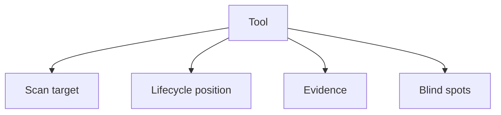

## Concrete DevOps example

Trivy can inspect a container image during CI and report known vulnerable packages. That evidence supports an image-release decision, but it does not prove that the running web application has no authorization flaw.

## Command explained piece by piece

```bash
tool --help
tool --version
```

- `tool`: placeholder for the selected tool.
- `--help`: reveals supported targets and options.
- `--version`: records the tested version so evidence is reproducible.

## Safe hands-on lab

Create this comparison table and complete it later for every Stage 10 tool:

| Tool | What it scans | When it runs | Evidence | What it misses |
|---|---|---|---|---|
| Example tool | Exact target | Lifecycle point | Finding/report/alert | Explicit blind spot |

## Expected output

A table whose entries are specific. Avoid vague phrases such as "scans security."

## Common mistakes

- Choosing a tool only because it is popular.
- Treating severity as the same thing as business risk.
- Ignoring false positives and false negatives.
- Claiming that a passing scan proves complete security.

## Short challenge

Explain why a secret scanner and a runtime detector cannot replace each other.

## Interview questions

1. What four questions should you ask when evaluating a security tool?
2. Why is scanner output evidence but not absolute proof?
3. What is a tool blind spot?

## Summary

Evaluate a tool by target, timing, evidence, and gaps. Choose tools for coverage and useful decisions, not for their count.

## Cheat sheet

| Question | Required answer |
|---|---|
| What? | Exact asset or artifact inspected |
| When? | DevOps lifecycle position |
| Evidence? | Output used to make or verify a decision |
| Misses? | Scope limits and likely blind spots |

**Exact next lesson:** Lesson 135 - Trivy.

---

# Lesson 135 - Trivy

**Roadmap focus:** Scan images, repositories, and configuration for several classes of risk; connect Trivy to build and CI stages.

## Simple overview

Trivy is a broad static security scanner. In this lesson, its role is to inspect repositories, container images, and configuration before release.

## Learning objectives

- Distinguish repository, image, and configuration targets.
- Place Trivy in local build and CI stages.
- Interpret a finding as evidence requiring validation and prioritization.

## Prerequisite check

You should understand Git repositories, container images, IaC/configuration, and CI.

## Plain-language theory

Trivy can find multiple classes of risk, including known vulnerabilities, exposed secrets, and configuration problems, depending on the target and enabled scanners. It is mainly a **pre-deployment static control**. Its vulnerability results depend on package identification and current vulnerability data. It cannot prove that application logic is secure or that production behavior is harmless.

## Diagram

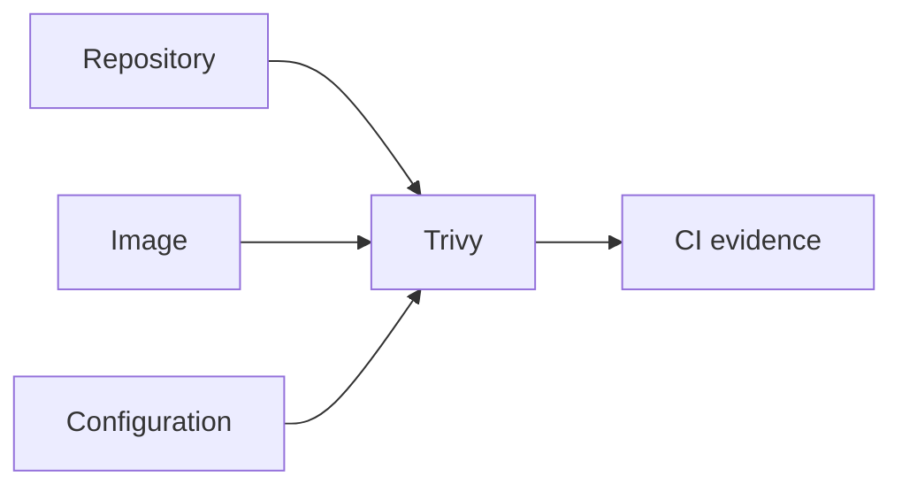

## Concrete DevOps example

After building `myapp:local`, CI scans the image. The team reviews affected packages and fixes or explicitly accepts validated risk before pushing the image to a registry.

## Commands explained piece by piece

```bash
trivy image myapp:local
trivy fs .
trivy config .
```

- `trivy image`: inspects the files and metadata inside a container image.
- `myapp:local`: the local image name and tag.
- `trivy fs`: scans a filesystem/repository path.
- `.`: the current project directory.
- `trivy config`: inspects supported configuration/IaC for misconfiguration.

## Safe hands-on lab

Use a disposable local project or image:

```bash
trivy image alpine:latest
trivy fs .
trivy config .
```

Before each command, write what target you predict it will inspect. Save only relevant, sanitized output.

## Expected output

The output may contain vulnerability, secret, or misconfiguration findings, with fields such as an identifier, severity, affected component or location, and possible remediation. A clean result means no finding under the enabled checks and available data; it does not mean zero risk.

## Common mistakes

- Confusing `image`, `fs`, and `config` targets.
- Failing CI on every unreviewed result without a policy.
- Using stale vulnerability data.
- Assuming an image scan tests the running web application.

## Short challenge

Choose which Trivy target you would use for a Docker image and which you would use for Terraform files, then justify both.

## Interview questions

1. Where does Trivy fit in CI?
2. What is the difference between `trivy image` and `trivy config`?
3. Why can Trivy and ZAP produce different findings for the same application?

## Summary

Trivy gives broad static coverage across repositories, images, and configuration. Connect it to build and CI, then validate findings in context.

## Cheat sheet

| Target | Command | Lifecycle |
|---|---|---|
| Container image | `trivy image IMAGE` | Build/CI |
| Repository/filesystem | `trivy fs PATH` | Local/CI |
| Configuration/IaC | `trivy config PATH` | Pull request/CI |

**Exact next lesson:** Lesson 136 - Gitleaks.

---

# Lesson 136 - Gitleaks

**Roadmap focus:** Detect likely secrets in working trees and Git history; connect it to pre-commit and CI.

## Simple overview

Gitleaks searches Git repositories, files, directories, or input for patterns that look like credentials, tokens, and keys.

## Learning objectives

- Explain why deleting a secret from the latest file may not remove it from Git history.
- Place Gitleaks in pre-commit and CI.
- Respond correctly to a confirmed exposed secret.

## Prerequisite check

You should understand commits, working trees, Git history, and why credentials must not be stored in source control.

## Plain-language theory

A secret can enter through an uncommitted file, a new commit, or an older commit. Pre-commit scanning gives fast feedback before data enters history; CI provides centralized enforcement. Pattern detection can produce false positives and can miss unknown secret formats.

If a real secret was committed, merely deleting the text is insufficient: revoke or rotate the credential first, then clean history according to team procedure.

## Diagram

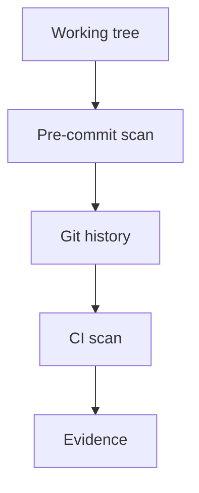

## Concrete DevOps example

A developer accidentally adds a fake API token to a local training repository. The pre-commit check blocks the commit. In production, a confirmed credential would be rotated, not merely removed.

## Commands explained piece by piece

```bash
gitleaks dir .
gitleaks git .
```

- `gitleaks dir`: scans files and directories.
- `gitleaks git`: scans a Git repository and its history.
- `.`: the current directory/repository.

## Safe hands-on lab

Use only a disposable repository and a clearly fake training value. Run a directory scan, initialize and commit the training file if needed, then run a Git-history scan. Remove the fake value afterward.

```bash
gitleaks dir .
gitleaks git .
```

Do not use real credentials.

## Expected output

A finding can include a rule ID, file, line, commit information, and masked secret. Exit behavior can be used by pre-commit or CI to block a change.

## Common mistakes

- Using real credentials in a demonstration.
- Printing an entire detected secret in a report.
- Deleting a leaked credential without rotating it.
- Scanning only the current files and ignoring history.

## Short challenge

Explain why pre-commit and CI scanning are both useful even when they use the same tool.

## Interview questions

1. Why does Git history matter for secret scanning?
2. What should happen after a real credential is exposed?
3. What can cause a false positive?

## Summary

Gitleaks detects likely secrets before and after commit. Use it early for feedback and in CI for shared enforcement.

## Cheat sheet

| Need | Command/position |
|---|---|
| Current files/directories | `gitleaks dir .` |
| Repository history | `gitleaks git .` |
| Earliest feedback | Pre-commit |
| Central enforcement | CI |

**Exact next lesson:** Lesson 137 - OWASP ZAP.

---

# Lesson 137 - OWASP ZAP

**Roadmap focus:** Perform defensive dynamic testing against an authorized running web application; design a local baseline-scan use case.

## Simple overview

OWASP ZAP examines a **running** web application. A baseline scan spiders the target briefly and reports passive findings without performing active attacks.

## Learning objectives

- Explain dynamic testing.
- Distinguish a baseline passive scan from an active scan.
- Design an authorized local baseline scan.

## Prerequisite check

You should know HTTP, URLs, Docker, and the difference between source artifacts and a running service.

## Plain-language theory

Dynamic application security testing observes a running application from the outside. ZAP may identify issues visible in requests and responses, such as security-header or cookie problems. A baseline scan does not prove business logic or authorization correctness. Active scanning sends attack-like requests and is outside this lesson's safe baseline lab.

## Diagram

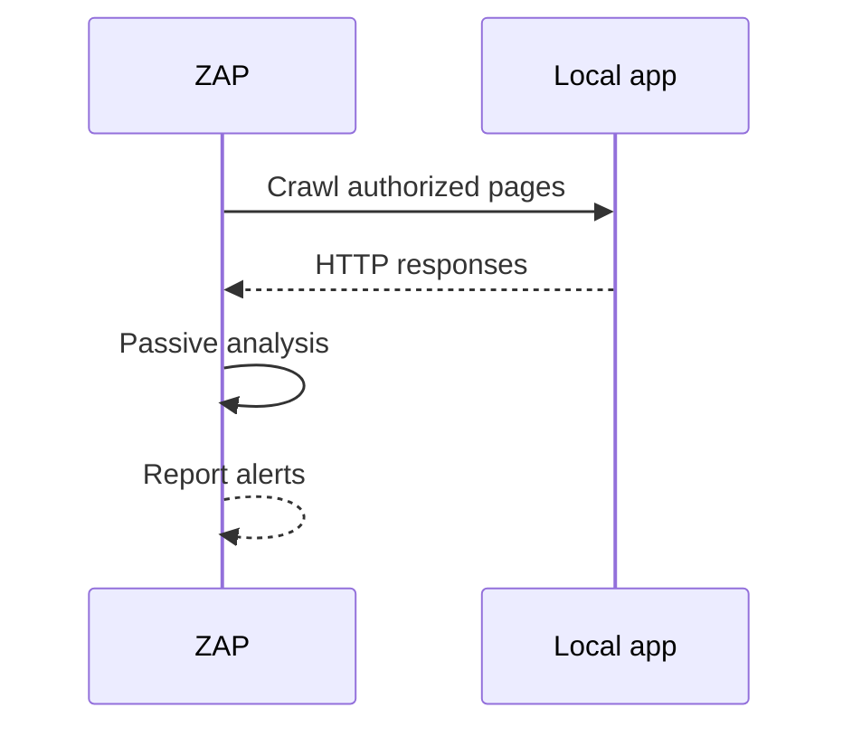

## Concrete DevOps example

CI starts a disposable test application, runs ZAP Baseline against its local test URL, stores an HTML report, and then destroys the environment.

## Command explained piece by piece

```bash
docker run --rm --network host \
  -v "$PWD:/zap/wrk:rw" \
  ghcr.io/zaproxy/zaproxy:stable \
  zap-baseline.py -t http://127.0.0.1:3000 -r zap-report.html
```

- `docker run --rm`: runs a temporary container and removes it afterward.
- `--network host`: lets the container reach a Linux host service; environment support varies.
- `-v "$PWD:/zap/wrk:rw"`: maps the current directory for report output.
- `ghcr.io/...:stable`: official stable ZAP container image.
- `zap-baseline.py`: time-limited spider plus passive scan.
- `-t`: authorized target URL.
- `-r`: HTML report filename.

## Safe hands-on lab

Run a disposable web app on your own machine at `127.0.0.1`, confirm the URL manually, and then run the baseline command. Do not replace the target with a public site.

## Expected output

ZAP reports PASS, WARN, or FAIL according to its configuration and returns an exit code. Findings commonly identify a URL, alert type, risk level, and evidence.

## Common mistakes

- Scanning a public target without authorization.
- Confusing the baseline scan with a full active scan.
- Running ZAP before the test service is ready.
- Treating every warning as a confirmed exploitable vulnerability.

## Short challenge

Explain what ZAP can observe that a container-image scanner cannot.

## Interview questions

1. What makes ZAP a dynamic tool?
2. Why is the baseline scan safer for this lab?
3. Why must the application be running?

## Summary

ZAP Baseline supplies passive evidence from an authorized running web app. It complements static tools but does not replace them.

## Cheat sheet

| Item | Meaning |
|---|---|
| Target | Authorized running URL |
| Baseline | Spider plus passive analysis |
| Evidence | Alerts, affected URLs, report, exit code |
| Limitation | Limited reachable paths and passive checks |

**Exact next lesson:** Lesson 138 - Nmap.

---

# Lesson 138 - Nmap

**Roadmap focus:** Discover hosts, ports, and services only on owned or authorized systems; plan a localhost-only discovery lab.

## Simple overview

Nmap describes network exposure: which hosts appear reachable, which ports are open, and which services may be listening.

## Learning objectives

- Distinguish host, port, and service discovery.
- Run a localhost-only scan.
- Explain why discovery is not the same as vulnerability confirmation.

## Prerequisite check

You should understand IP addresses, TCP/UDP ports, client/server communication, and authorization boundaries.

## Plain-language theory

An open port means a service accepted or appeared to accept network communication. Service detection makes an informed identification attempt. Results depend on network path, permissions, firewall behavior, and scan options. Nmap shows attack surface, not complete application risk.

## Diagram

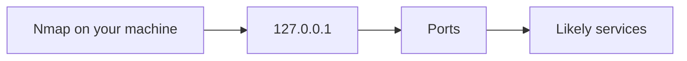

## Concrete DevOps example

After deploying a local test service, a developer checks whether only the intended port is exposed on localhost.

## Command explained piece by piece

```bash
nmap -sV 127.0.0.1
```

- `nmap`: starts the scanner.
- `-sV`: attempts service and version detection on discovered open ports.
- `127.0.0.1`: loopback address, limited to the local machine.

For a smaller test:

```bash
nmap -sV -p 3000 127.0.0.1
```

- `-p 3000`: checks only port 3000.

## Safe hands-on lab

Start a disposable local service on port 3000, scan only `127.0.0.1`, stop the service, and scan the same port again. Compare before/after evidence.

## Expected output

The result lists port state, protocol, and possible service/version. After stopping the service, the port should no longer appear open, although the exact state can differ by local network behavior.

## Common mistakes

- Scanning a subnet or external host without permission.
- Assuming a detected version is always exact.
- Calling every open port a vulnerability.
- Using broad scan options when one local port answers the question.

## Short challenge

Explain the difference between "port 3000 is open" and "the service on port 3000 is vulnerable."

## Interview questions

1. What does `-sV` do?
2. Why is localhost appropriate for this lab?
3. How can a firewall affect results?

## Summary

Nmap identifies reachable network exposure. Use the smallest authorized scope and treat service detection as evidence to validate.

## Cheat sheet

| Need | Command |
|---|---|
| Local discovery | `nmap 127.0.0.1` |
| One local port | `nmap -p PORT 127.0.0.1` |
| Service detection | `nmap -sV 127.0.0.1` |

**Exact next lesson:** Lesson 139 - Falco.

---

# Lesson 139 - Falco

**Roadmap focus:** Detect suspicious runtime behavior using Linux and container events; classify example runtime alerts.

## Simple overview

Falco observes event streams at runtime and compares behavior with security rules. Unlike pre-deployment scanners, it detects activity while systems are running.

## Learning objectives

- Explain runtime detection.
- Identify the event, rule, priority, and context in an alert.
- Classify example alerts without assuming every alert is an attack.

## Prerequisite check

You should understand Linux processes, files, containers, logs, and detection versus prevention.

## Plain-language theory

Falco consumes events, commonly from the Linux kernel, and evaluates them against rules. A matching event produces an alert. The alert is a signal for investigation: legitimate administration can sometimes match a rule, while malicious behavior can avoid rules that do not cover it.

## Diagram

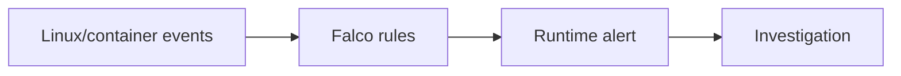

## Concrete DevOps example

A shell starts unexpectedly inside a production container. Falco raises an alert containing the container and process context. The response process validates whether the shell was authorized.

## Command explained piece by piece

The roadmap requires alert classification rather than a privileged installation lab. For an installed authorized lab, the basic inspection command is:

```bash
falco --version
```

- `falco`: runtime detection engine.
- `--version`: records the exact version used for evidence.

Falco normally requires host-level event access and careful installation; do not grant privileged access merely for this lesson.

## Safe hands-on lab

Classify these fictional alerts:

| Alert | Classification question |
|---|---|
| Shell spawned in a container | Was interactive shell access expected? |
| Sensitive file opened for writing | Which process and identity wrote it? |
| Package manager executed in a container | Was this part of an approved maintenance action? |

For each, record: event, affected workload, rule/priority, likely benign explanation, suspicious explanation, and next verification step.

## Expected output

A classification such as **expected**, **suspicious**, or **needs context**, supported by event details rather than priority alone.

## Common mistakes

- Treating every alert as a confirmed incident.
- Ignoring container, user, process, and time context.
- Confusing detection with prevention.
- Installing Falco with broad privileges on an unsuitable machine.

## Short challenge

Describe one case in which a high-priority alert might still be legitimate.

## Interview questions

1. What data does Falco analyze?
2. Why is an alert not automatically an incident?
3. How does Falco complement Trivy?

## Summary

Falco adds runtime visibility through event-based rules. Classify and investigate alerts using context.

## Cheat sheet

| Alert field | Question |
|---|---|
| Rule | What behavior matched? |
| Priority | How seriously is it labeled? |
| Process/user | Who did what? |
| Container/host | Where did it happen? |
| Time | When and around what change? |

**Exact next lesson:** Lesson 140 - Checkov.

---

# Lesson 140 - Checkov

**Roadmap focus:** Statically inspect infrastructure-as-code for misconfiguration and policy issues; choose where it runs in pull requests.

## Simple overview

Checkov scans IaC before it creates real infrastructure, allowing policy problems to be reviewed in the pull request.

## Learning objectives

- Explain IaC static analysis.
- Interpret passed and failed checks.
- Place Checkov in local development and pull-request CI.

## Prerequisite check

You should recognize Terraform or another supported IaC format and understand pull requests.

## Plain-language theory

IaC describes intended infrastructure. Checkov compares that description with policies and reports passes and failures. Finding a bad configuration before deployment is cheaper and safer than discovering it in production. However, static IaC may not show manual cloud changes or the final runtime state.

## Diagram

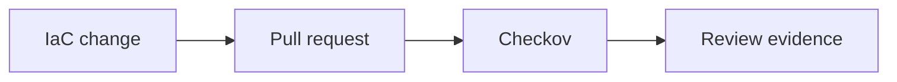

## Concrete DevOps example

A Terraform pull request introduces a publicly reachable resource. Checkov reports a failed policy, and the author changes the configuration before merge.

## Command explained piece by piece

```bash
checkov -d .
```

- `checkov`: starts the IaC policy scanner.
- `-d`: selects a directory.
- `.`: scans the current directory.

For one file:

```bash
checkov -f main.tf
```

- `-f`: selects a specific file.
- `main.tf`: local Terraform file.

## Safe hands-on lab

Use a disposable Terraform example containing no credentials and run `checkov -f main.tf`. Record one passed and one failed policy if present, then explain what configuration each check evaluated.

## Expected output

Checkov reports counts of passed, failed, and skipped checks. A failure usually includes a check ID, check name, resource, file, and line range.

## Common mistakes

- Adding real cloud credentials to IaC.
- Skipping a check without written justification.
- Assuming a passed source scan reflects manual production changes.
- Running the check only after merge.

## Short challenge

Choose whether Checkov should run before, during, or after a pull request and justify your answer.

## Interview questions

1. What does Checkov inspect?
2. Why is pull-request placement useful?
3. What can static IaC scanning miss?

## Summary

Checkov provides early policy evidence about IaC. Run it locally and in pull requests before infrastructure changes are merged.

## Cheat sheet

| Scope | Command |
|---|---|
| Directory | `checkov -d .` |
| File | `checkov -f main.tf` |
| Best stage | Local development and pull request |

**Exact next lesson:** Lesson 141 - Semgrep.

---

# Lesson 141 - Semgrep

**Roadmap focus:** Use configurable static rules to find code patterns; compare one Semgrep use case with dependency scanning.

## Simple overview

Semgrep analyzes source-code patterns using configurable rules. It answers different questions from a dependency scanner.

## Learning objectives

- Explain rule-based static code analysis.
- Run a local source scan with a selected ruleset.
- Distinguish code-pattern findings from dependency findings.

## Prerequisite check

You should understand source code, dependencies, pull requests, and static analysis.

## Plain-language theory

Semgrep rules describe code patterns to report. A rule can look for unsafe API usage or risky coding constructs. Results depend on language support and chosen rules. Dependency scanning instead identifies third-party components and known vulnerabilities associated with their versions. One inspects **how code is written**; the other inspects **what packages are included**.

## Diagram

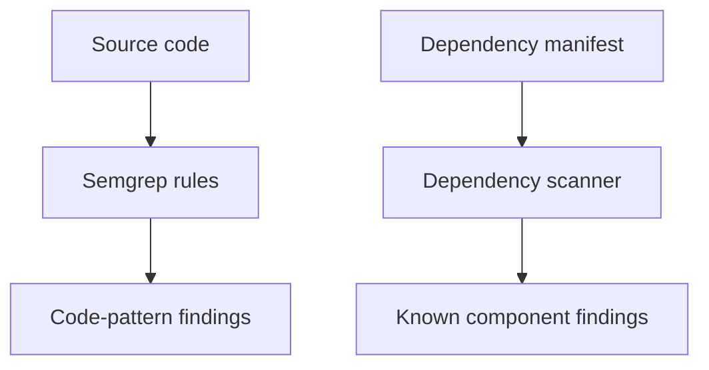

## Concrete DevOps example

Semgrep flags dangerous shell execution in first-party Python code. A dependency scanner separately reports a vulnerable library version. Fixing one does not automatically fix the other.

## Command explained piece by piece

```bash
semgrep scan --config p/default .
```

- `semgrep scan`: recommended local scan command.
- `--config p/default`: selects a ruleset.
- `.`: scans the current project.

To save machine-readable evidence:

```bash
semgrep scan --config p/default --json --output semgrep.json .
```

- `--json`: selects JSON output.
- `--output`: writes output to a file.

## Safe hands-on lab

Run Semgrep against a disposable local sample or your own authorized project. Review one finding and identify the rule, file, code pattern, and suggested correction. Do not upload proprietary code to an unapproved service.

## Expected output

A finding commonly identifies a rule ID, message, severity, file, and source location. No findings means the selected rules did not match the scanned code.

## Common mistakes

- Believing Semgrep automatically scans every dependency vulnerability.
- Running an unspecified rule collection and being unable to reproduce results.
- Treating a pattern match as confirmed exploitability.
- Ignoring generated or excluded files without checking scan scope.

## Short challenge

Give one source-code problem for Semgrep and one third-party-package problem for dependency scanning.

## Interview questions

1. What controls what Semgrep finds?
2. How is Semgrep different from dependency scanning?
3. Where should Semgrep run in DevOps?

## Summary

Semgrep uses configurable static rules to find source-code patterns. Pair it with dependency scanning because their targets differ.

## Cheat sheet

| Tool type | Primary target | Example evidence |
|---|---|---|
| Semgrep | First-party source patterns | Rule and code location |
| Dependency scanner | Third-party components | Package, version, advisory |

**Exact next lesson:** Lesson 142 - Snyk Research.

---

# Lesson 142 - Snyk Research

**Roadmap focus:** Understand Snyk product categories and where a hosted platform may fit; compare research findings with free local tools.

## Simple overview

This is a research lesson, not a required Snyk account or scanning lab. The goal is to map Snyk's categories to lifecycle needs and compare a hosted platform with local tools.

## Learning objectives

- Identify Snyk's major security scanning categories.
- Explain where a hosted platform fits in DevOps.
- Compare platform integration with free local tools without claiming one is universally better.

## Prerequisite check

You should understand source-code, dependency, container, and IaC scanning.

## Plain-language theory

Snyk provides scanning across first-party code, open-source dependencies, containers, and IaC. A hosted platform can centralize policies, projects, integrations, reporting, and remediation workflows. Local tools can be simple, scriptable, and usable without sending results to a hosted dashboard. Actual feature availability can depend on product plan and current documentation.

## Diagram

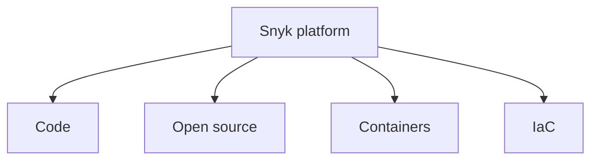

## Concrete DevOps example

A team wants one dashboard across repositories and CI integrations. It evaluates whether a hosted platform's centralized policy and reporting justify using it alongside or instead of separate local scanners.

## Commands explained piece by piece

No scanning command is required by this roadmap lesson. Use documentation research and record:

- product category;
- scan target;
- lifecycle integration;
- evidence/reporting;
- local or hosted processing considerations;
- free-plan or licensing limits that require current verification.

## Safe hands-on lab

Complete this research table from current official documentation:

| Category | Target | Lifecycle fit | Comparable local tool in this stage |
|---|---|---|---|
| Code | First-party code | Local/PR/CI | Semgrep |
| Open source | Dependencies | Local/PR/CI | Trivy where supported |
| Container | Container image | Build/CI | Trivy |
| IaC | Infrastructure code | PR/CI | Checkov or Trivy |

## Expected output

A sourced comparison that separates documented facts from your recommendation.

## Common mistakes

- Treating marketing categories as proof of complete coverage.
- Comparing tools without matching the same target and lifecycle point.
- Ignoring data handling, licensing, and integration needs.
- Using outdated product-plan claims.

## Short challenge

Give one reason a team might prefer a hosted platform and one reason it might prefer local tools.

## Interview questions

1. Which major targets does Snyk cover?
2. Where can a hosted platform add value?
3. Why must plan and feature claims be verified currently?

## Summary

Research Snyk by product category and lifecycle fit. Compare it fairly with local tools using target, evidence, integration, and gaps.

## Cheat sheet

| Comparison axis | Question |
|---|---|
| Coverage | What artifact is scanned? |
| Workflow | Local, PR, CI, or hosted dashboard? |
| Evidence | Findings, policy, trends, reports? |
| Constraints | Data handling, pricing, account, integration? |

**Exact next lesson:** Lesson 143 - Tool Overlap and Gaps.

---

# Lesson 143 - Tool Overlap and Gaps

**Roadmap focus:** Avoid assuming that five scanners equal complete protection; build a coverage matrix across code, dependencies, secrets, images, IaC, runtime, and web.

## Simple overview

Tools overlap in some areas and leave gaps in others. A coverage matrix makes this visible.

## Learning objectives

- Map tools to seven roadmap coverage areas.
- Identify useful overlap and missing coverage.
- Explain why tool count is a poor security metric.

## Prerequisite check

You should be able to state the target and lifecycle position of Lessons 135-142.

## Plain-language theory

Overlap can be valuable: two controls may catch the same risk at different times. But duplicate tools do not compensate for an uncovered runtime or web layer. Coverage also does not prove effectiveness; configuration, rules, reachability, and response processes matter.

## Diagram

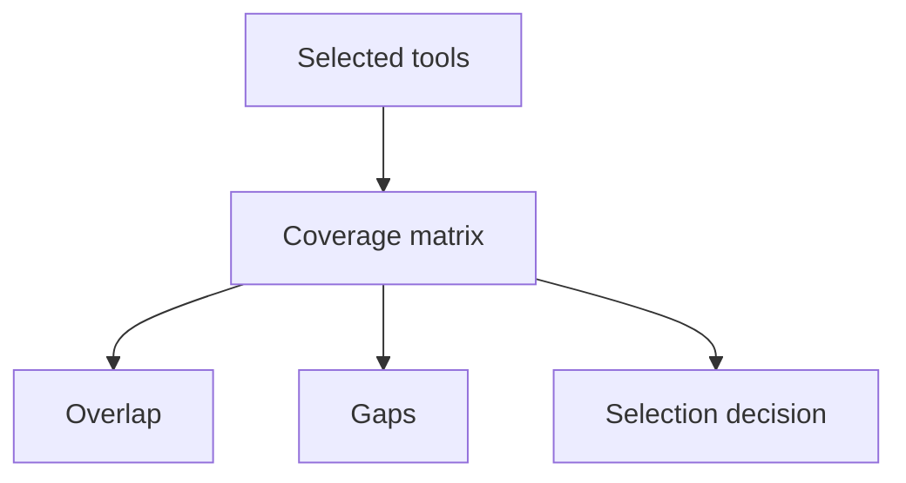

## Concrete DevOps example

Trivy and Checkov can both contribute IaC findings, but neither provides the same runtime event detection as Falco or running-web observation as ZAP.

## Commands explained piece by piece

No new command is required. Use the verified outputs and documentation from Lessons 135-142.

## Safe hands-on lab

Build this matrix. Use **Primary**, **Partial**, or **No** rather than checkmarks that imply equal coverage.

| Tool | Code | Dependencies | Secrets | Images | IaC | Runtime | Web |
|---|---|---|---|---|---|---|---|
| Trivy | Partial | Primary | Partial | Primary | Primary | No | No |
| Gitleaks | No | No | Primary | No | No | No | No |
| ZAP | No | No | No | No | No | No | Primary |
| Nmap | No | No | No | No | No | No | Partial: network exposure |
| Falco | No | No | No | No | No | Primary | No |
| Checkov | No | No | Partial where enabled | No | Primary | No | No |
| Semgrep | Primary | No | Not its roadmap use here | No | No | No | No |
| Snyk categories | Primary | Primary | Category-dependent | Primary | Primary | No | No |

Treat this as a Stage 10 learning matrix, not a permanent product specification; verify current capabilities before production selection.

## Expected output

A matrix plus:

- one area with overlap;
- one gap;
- one lifecycle stage with weak evidence;
- one recommendation to improve balance.

## Common mistakes

- Counting tools instead of mapping targets.
- Marking partial coverage as complete.
- Forgetting runtime and the running web app.
- Assuming alerts are useful without ownership and response.

## Short challenge

Select three tools with the widest **different** lifecycle coverage and explain what remains uncovered.

## Interview questions

1. Why can overlap be useful?
2. Why does five tools not mean complete security?
3. What seven coverage areas does the roadmap require?

## Summary

Use a matrix across code, dependencies, secrets, images, IaC, runtime, and web to reveal overlap and gaps.

## Cheat sheet

`Coverage = target + lifecycle stage + configured rules + usable evidence`

**Exact next lesson:** Lesson 144 - Selecting Five Tools.

---

# Lesson 144 - Selecting Five Tools

**Roadmap focus:** Choose at least five based on lifecycle coverage and task evidence; recommend a balanced set and justify it.

## Simple overview

Select tools because together they provide balanced lifecycle coverage and clear assignment evidence.

## Learning objectives

- Choose at least five tools.
- Justify each selection by target, lifecycle position, and evidence.
- State the remaining gaps.

## Prerequisite check

You must have completed the Lesson 143 coverage matrix.

## Plain-language theory

A balanced set reaches different artifacts and stages. A reasonable Stage 10 selection is:

1. **Gitleaks** - secrets before commit and in Git history.
2. **Semgrep** - first-party code patterns during development and CI.
3. **Trivy** - dependencies/images/configuration during build and CI.
4. **Checkov** - IaC policy in pull requests.
5. **OWASP ZAP** - the authorized running web application during test.
6. **Falco** - runtime behavior after deployment.

The roadmap says **at least five**, so six is acceptable when the extra tool closes the runtime gap. Nmap may be selected when network exposure is a central requirement. Snyk may fit when hosted platform integration is justified.

## Diagram

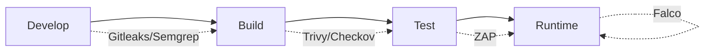

## Concrete DevOps example

A team uses Gitleaks and Semgrep on changes, Checkov on IaC pull requests, Trivy after image build, ZAP in a disposable test environment, and Falco in runtime. Each produces different evidence.

## Commands explained piece by piece

No new command is required. Selection is based on the comparison evidence already created.

## Safe hands-on lab

Complete this recommendation table:

| Selected tool | Main target | Lifecycle position | Evidence | Why selected | Remaining gap |
|---|---|---|---|---|---|
| Gitleaks | Secrets/Git history | Pre-commit/CI | Finding with file/commit/rule | Prevent secret exposure early | Unknown secret formats |
| Semgrep | Source patterns | Local/PR/CI | Rule and code location | First-party code coverage | Rule/language limits |
| Trivy | Repo/image/config | Build/CI | Vulnerability or config report | Broad artifact coverage | Runtime/business logic |
| Checkov | IaC | Pull request/CI | Policy pass/fail | Pre-deployment policy | Runtime drift |
| ZAP | Running web app | Test | Alert and URL report | Dynamic web evidence | Unreached paths/logic |
| Falco | Runtime events | Runtime | Rule-based alert | Post-deployment detection | Uncovered behaviors |

## Expected output

At least five justified selections, with no claim of complete security and at least one stated remaining gap.

## Common mistakes

- Selecting five tools that scan nearly the same target.
- Omitting lifecycle position.
- Giving tool descriptions without a use case.
- Hiding gaps instead of documenting them.

## Short challenge

If limited to five tools, remove one from the six-tool example and explain the accepted loss of coverage.

## Interview questions

1. What makes a toolset balanced?
2. Why might six tools be better justified than exactly five?
3. What evidence should support a selection?

## Summary

Choose at least five tools by lifecycle coverage and evidence. Acknowledge gaps and avoid equating quantity with security.

## Cheat sheet

`Selection justification = target + lifecycle position + evidence + unique value + remaining gap`

**Exact next lesson:** Lesson 145 - Stage 10 Checkpoint.

---

# Lesson 145 - Stage 10 Checkpoint

**Roadmap focus:** Document purpose, use case, and lifecycle position for each selected tool; complete the Task Part 9 table.

## Simple overview

The checkpoint converts your learning into the Task Part 9 deliverable: at least five clear tool profiles.

## Learning objectives

- Produce the final Task Part 9 table.
- Connect purpose, use case, and lifecycle position.
- Verify every claim and attach useful evidence.

## Prerequisite check

You should have completed Lessons 134-144 and selected at least five tools.

## Plain-language theory

A tool profile is not a copied product description. It explains:

- **Purpose:** what security problem the tool addresses.
- **Use case:** a concrete DevOps situation in which your team uses it.
- **Lifecycle position:** exactly when it runs.
- **Evidence:** what output supports a decision or verifies remediation.
- **Limit:** what the result does not prove.

## Diagram

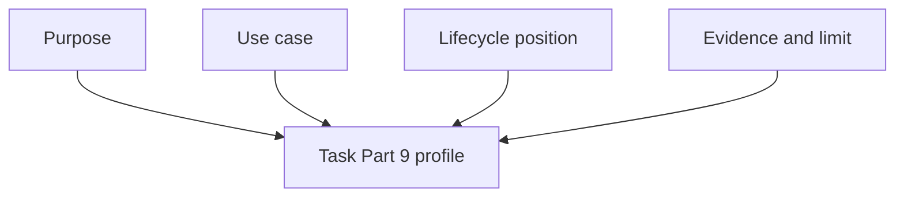

## Concrete DevOps example

"Run Trivy after building the container image in CI. Its purpose is to identify known vulnerable packages and configuration issues in the release artifact. The report identifies affected components and remediation information. It does not test application authorization or runtime behavior."

## Commands explained piece by piece

No new scanner command is required. Reuse sanitized evidence from the earlier labs. Record each tool version:

```bash
TOOL_NAME --version
```

Replace `TOOL_NAME` with the real command. The version makes your evidence reproducible.

## Safe hands-on lab - Final Task Part 9 table

Complete at least five rows:

| Tool | Purpose | Concrete DevOps use case | Lifecycle position | Evidence produced | Important limitation |
|---|---|---|---|---|---|
| Gitleaks | Detect likely exposed secrets | Block a commit/CI job containing a likely token | Pre-commit and CI | Rule, file, commit, exit result | Pattern-based; requires validation |
| Semgrep | Find configured source-code patterns | Review risky first-party code in a PR | Local, PR, CI | Rule, message, file, code location | Depends on rules and language support |
| Trivy | Scan repositories, images, and configuration | Scan a built image before registry push | Build and CI | Affected component/config, severity, fix data | Does not test runtime business logic |
| Checkov | Inspect IaC policy and misconfiguration | Review Terraform before merge | Pull request and CI | Check ID, resource, pass/fail | Does not prove final cloud state |
| OWASP ZAP | Dynamically inspect an authorized running web app | Baseline scan a disposable test deployment | Test/staging | Alert, URL, risk, report | Limited by reachable paths and scan mode |
| Falco | Detect suspicious runtime behavior | Alert on an unexpected shell in a container | Runtime/production | Rule, priority, process/container context | Alert requires investigation |

## Expected output

Your completed checkpoint must contain:

- at least five tools;
- purpose, concrete use case, and lifecycle position for every tool;
- evidence and a limitation for stronger evaluation;
- sanitized lab evidence or sourced research;
- no claims that a passing scan proves complete security.

## Common mistakes

- Copying descriptions without connecting them to DevOps.
- Writing "CI/CD" without saying the actual point.
- Missing evidence or tool version.
- Including secret values or sensitive output.
- Failing to document blind spots.

## Short challenge

Present your table aloud in two minutes. For each tool, say: "It scans ___, runs during ___, produces ___, and does not prove ___."

## Interview questions

1. Why did you choose these tools?
2. Where does each one run?
3. What does each tool miss?
4. Which tool gives pre-commit evidence, dynamic test evidence, and runtime evidence?
5. How do you verify remediation after a finding?

## Summary

Stage 10 is complete when you can defend at least five tool choices using purpose, use case, lifecycle position, evidence, and limitations.

## Cheat sheet

| Required checkpoint item | Done? |
|---|---|
| At least five tool profiles | ☐ |
| Purpose for each tool | ☐ |
| Concrete DevOps use case | ☐ |
| Exact lifecycle position | ☐ |
| Evidence/output described | ☐ |
| Limitation documented | ☐ |
| Sanitized lab evidence | ☐ |
| Current sources recorded | ☐ |

**Exact next lesson:** Lesson 146 - Choose a Suitable Incident (Stage 11).

---

# Official references

These references support the current tool behavior and commands used in the lessons:

- [Trivy documentation](https://trivy.dev/)
- [Trivy container-image target](https://trivy.dev/docs/latest/guide/target/container_image/)
- [Gitleaks official repository and command documentation](https://github.com/gitleaks/gitleaks)
- [OWASP ZAP Baseline Scan](https://www.zaproxy.org/docs/docker/baseline-scan/)
- [Nmap Reference Guide](https://nmap.org/book/man.html)
- [Falco documentation](https://falco.org/docs/)
- [Checkov Quick Start](https://www.checkov.io/1.Welcome/Quick%20Start.html)
- [Semgrep local CLI scans](https://docs.semgrep.dev/getting-started/cli)
- [Snyk scan, fix, and prevent overview](https://docs.snyk.io/scan-fix-and-prevent)
