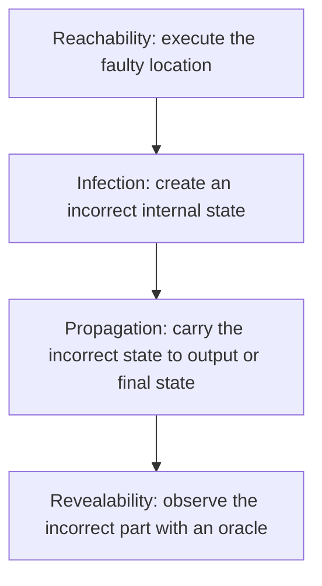
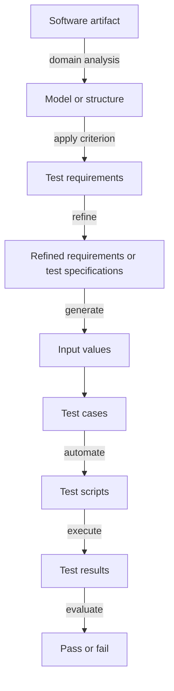

# Chapter 2 - Model-Driven Test Design

**Book:** *Introduction to Software Testing*, Second Edition  
**Authors:** Paul Ammann and Jeff Offutt  
**Book coverage:** Chapter 2, pages 22-42  
**Roadmap:** Improved 22-Week Roadmap, Week 2  
**Recommended study time:** Three sessions of 60-90 minutes

---

## How to use this lesson

- **Session 1 - Foundations:** Sections 1-6: testing foundations, RIPR, activities, levels, and coverage criteria.
- **Session 2 - MDTD:** Sections 7-9: the complete process, the book's small example, and the worked booking example.
- **Session 3 - Application:** Sections 10-15: guided practice, independent application, knowledge check, revision, and mastery.

Write the reason for every test you design. A list of inputs without test requirements or rationale is not a complete MDTD result.

---

## 0. Prerequisite check

Before starting, confirm that you can explain these Chapter 1 terms:

| Term | Your one-sentence explanation |
| --- | --- |
| Fault |  |
| Error state |  |
| Failure |  |
| Program state |  |
| Testing |  |
| Debugging |  |

You should also be able to explain why executing a faulty statement does not guarantee that a failure will be observed.

**Bridge rule:** If fault, error, and failure are still mixed together, review the `numZero()` example from Chapter 1 before studying RIPR.

---

## 1. Chapter purpose

Software is too complex to test by trying every possible input. Chapter 2 introduces the conceptual process used throughout the rest of the book to manage that complexity.

Instead of selecting test values immediately, the tester works at two levels:

1. **Design abstraction level:** Analyze a software artifact, create an abstract model, apply a criterion, and derive test requirements.
2. **Implementation abstraction level:** Convert those requirements into concrete values, test cases, executable scripts, results, and pass/fail decisions.

This process is called **Model-Driven Test Design (MDTD)**.

Chapter 1 explained why testing is necessary. Chapter 2 explains how systematic test design is organized. Chapters 5-9 will later provide the detailed criteria used with input domains, graphs, logic expressions, and syntax descriptions.

---

## 2. Learning outcomes

After completing this chapter, you should be able to:

1. Define testing, a test failure, and debugging.
2. Explain all four conditions of the RIPR model.
3. Distinguish test design, automation, execution, and evaluation.
4. Explain traditional and object-oriented testing levels.
5. Define a test criterion and a test requirement.
6. Distinguish test requirements from test values and executable tests.
7. Explain why exhaustive testing is normally impossible.
8. Move from a software artifact to a model and then to executable tests.
9. Explain the purpose of abstraction in MDTD.
10. Identify which parts of a test design can remain stable when the implementation framework changes.

---

## 3. Key vocabulary

### 3.1 Testing

**Precise meaning:** Evaluating software by observing its execution.

Testing runs software and examines behavior. Static analysis may contribute to software quality, but it is not included in this specific definition of testing used by the chapter.

### 3.2 Test failure

**Precise meaning:** The execution of a test that results in a software failure.

A software failure is the incorrect behavior. A test failure is the event in which a test execution exposes that behavior.

### 3.3 Debugging

**Precise meaning:** Finding a fault after a failure has been observed.

Testing reveals evidence of incorrect behavior. Debugging searches for the defect that caused it.

### 3.4 Software artifact

An artifact is a software-related item from which testing information can be derived, such as:

- requirements;
- design descriptions;
- source code;
- use cases; or
- state behavior.

### 3.5 Model or structure

An abstract representation derived from a software artifact. The model removes unnecessary detail so that a tester can reason about important testing obligations systematically.

### 3.6 Test criterion

A collection of rules and a process that define test requirements.

Examples introduced by the chapter include rules such as covering every statement or every functional requirement.

### 3.7 Test requirement

A specific item that must be satisfied or covered during testing.

If the criterion is "cover every statement," each reachable statement may become a test requirement.

### 3.8 Refined test requirement or test specification

A test requirement with enough additional detail to support the selection of concrete input values and expected behavior.

### 3.9 Test value

A concrete input chosen to satisfy a test requirement.

The requirement states *what must be covered*. The value states *which concrete data will cover it*.

### 3.10 Test case

The concrete information needed for one test, including input values and expected behavior. Depending on the system, it may also require setup values before execution and cleanup actions afterward.

### 3.11 Test script

An executable representation of one or more test cases.

### 3.12 Test oracle

The mechanism or knowledge used to determine whether an observed result is correct. Revealability in RIPR depends on observing the relevant incorrect part of the final state.

---

## 4. Section 2.1 - Software testing foundations

### 4.1 What passing tests can and cannot show

Testing can demonstrate the presence of failures. It cannot demonstrate that failures are absent from all possible executions.

If a suite passes, we know that the observed executions produced their expected results. We do not know that every other input, state, sequence, or environment would also behave correctly.

The quality of the evidence depends on how the tests were designed.

### 4.2 The RIPR model

Four conditions are necessary for a fault to be observed through a test failure.



#### Reachability

The test must execute the location that contains the fault.

If execution never reaches the faulty statement, that test cannot expose the fault.

#### Infection

Executing the fault must cause the program state to become incorrect.

A faulty expression may still produce the correct value for some inputs. Those inputs reach the fault but do not infect the state.

#### Propagation

The incorrect state must affect an output or final state.

An internal error may be overwritten, corrected by coincidence, or otherwise prevented from reaching externally relevant behavior.

#### Revealability

The tester must observe the incorrect part of the final state.

Even when the output is wrong, a test passes incorrectly if its oracle does not check the affected value.

### 4.3 RIPR applied to the Chapter 1 example

The faulty `numZero()` method begins scanning an array at index `1` instead of index `0`.

| RIPR condition | Input `[2, 7, 0]` | Input `[0, 7, 2]` |
| --- | --- | --- |
| Reachability | Yes: the faulty initialization is executed. | Yes: the faulty initialization is executed. |
| Infection | Yes: the initial state has `i = 1` instead of `i = 0`. | Yes: the initial state has `i = 1` instead of `i = 0`. |
| Propagation | No: skipping `2` does not change the final count. | Yes: skipping the first zero makes the returned count incorrect. |
| Revealability | There is no incorrect returned count to reveal. | Yes, if the test oracle checks that the result must be `1`. |

The comparison shows why reaching a fault is weaker than revealing a failure.

---

## 5. Sections 2.2-2.3 - Testing activities and levels

### 5.1 Test engineer and test manager

The chapter describes a **test engineer** as a professional responsible for one or more technical testing activities, such as designing inputs, producing values, running scripts, analyzing results, and reporting results.

A **test manager** is responsible for test policies, processes, coordination with other managers, and support for the test engineers.

### 5.2 The four main testing activities

| Activity | Central question | Main output |
| --- | --- | --- |
| **Test design** | What should be tested, and what requirements should the tests satisfy? | Models, criteria, test requirements, and test specifications |
| **Test automation** | How will the designed tests become executable? | Test scripts containing values, setup, actions, and expected results |
| **Test execution** | What happened when the scripts ran? | Recorded test results |
| **Test evaluation** | What do the results mean, and should the test pass or fail? | Pass/fail decisions and reports |

These activities require different skills. Treating them as one undifferentiated task can waste expertise and weaken the test process.

### 5.3 Two forms of test design

#### Criteria-based test design

Test values are designed to satisfy coverage criteria or another engineering goal. This work depends heavily on discrete mathematics, programming, and testing knowledge.

#### Human-based test design

Tests are designed using domain knowledge and human knowledge of testing. This is essential because formal criteria can miss special situations that an experienced domain expert recognizes.

The two approaches support each other. Criteria provide systematic obligations; human insight identifies risks and situations that a model may not capture.

### 5.4 Other supporting activities

- **Test management:** Establish policies, organize the team, select criteria, and decide the required degree of automation.
- **Test maintenance:** Preserve tests for reuse as software changes and decide when the suite should be updated or reduced.
- **Test documentation:** Record why each test exists, including the criterion, test requirement, or human rationale it addresses.

Tests should be maintained under configuration control, just like other valuable software artifacts.

### 5.5 Traditional testing levels

| Level | Scope | Main question |
| --- | --- | --- |
| **Unit testing** | An individual unit, commonly a method | Does this unit behave correctly by itself? |
| **Module testing** | A class, file, module, or component | Does the complete module behave correctly? |
| **Integration testing** | Interactions among modules | Do connected modules communicate and cooperate correctly? |
| **System testing** | The complete system | Does the overall system functionality behave correctly? |
| **Acceptance testing** | The system from the user's perspective | Is the software acceptable for the intended user? |

### 5.6 Object-oriented testing levels

| Object-oriented level | Scope |
| --- | --- |
| **Intra-method** | One method individually |
| **Inter-method** | Interactions or sequences involving methods in the same class |
| **Intra-class** | The behavior of an entire class through sequences of calls |
| **Inter-class** | Multiple classes working together |

### 5.7 The V model relationship

The chapter connects development activities with corresponding testing levels.

| Development activity | Corresponding testing level |
| --- | --- |
| Requirements | Acceptance testing |
| Architectural design | System testing |
| Subsystem design | Integration testing |
| Detailed design | Module testing |
| Implementation | Unit testing |

The important idea is that testing is connected to artifacts produced throughout development, not only to finished code.

---

## 6. Section 2.4 - Coverage criteria

### 6.1 Why exhaustive testing is impractical

Even a small method can have an enormous input space. The chapter illustrates this with a method that accepts three 32-bit integer parameters. Each parameter has more than four billion possible values, creating more than 80 octillion possible combinations.

Testing every combination is not realistic. Testers therefore need structured methods for selecting a small set of valuable tests.

### 6.2 Purpose of coverage criteria

Coverage criteria provide practical rules for searching a huge input space. They help the tester:

- select tests systematically;
- reduce unnecessary overlap;
- trace tests back to software artifacts;
- support regression testing;
- state a measurable stopping condition; and
- use tools to measure progress.

A stopping condition based on a criterion does not mean that the software is fault-free. It means that the specific requirements imposed by that criterion have been satisfied.

### 6.3 Criterion versus requirement

| Concept | Example |
| --- | --- |
| Criterion | Cover every statement. |
| Test requirements produced by it | Execute statement 1, execute statement 2, execute statement 3, and so on. |
| Test values | Concrete inputs selected to execute those statements. |
| Test cases | Inputs plus expected behavior and necessary setup/cleanup. |

### 6.4 Four structures used by the book

The many criteria in software testing can be organized around four types of structures:

1. Input domains
2. Graphs
3. Logic expressions
4. Syntax descriptions

These structures form the foundation of Chapters 6-9.

### 6.5 Beyond black-box and white-box labels

The older classification asks whether tests come from external descriptions or internal source code. MDTD asks a more general and useful question:

> From which abstraction level and structure are the tests derived?

Requirements, designs, source code, and other artifacts can all be transformed into models from which systematic test requirements are derived.

---

## 7. Section 2.5 - The complete MDTD process

### 7.1 Process map



### 7.2 Step-by-step explanation

#### Step 1 - Select the software artifact

Choose the item to be tested, such as a requirement, design, source method, use case, or state description.

#### Step 2 - Perform domain analysis

Study the artifact and identify the information that matters for testing.

#### Step 3 - Create a model or structure

Represent the relevant information abstractly. Unnecessary implementation detail is deliberately removed.

#### Step 4 - Apply a criterion

Choose rules that describe how the model should be covered.

#### Step 5 - Derive test requirements

List the specific model elements, conditions, paths, or rules that tests must satisfy.

#### Step 6 - Refine the requirements

Add constraints and expected behavior so that concrete values can be selected.

#### Step 7 - Generate input values

Choose values that satisfy the refined requirements.

#### Step 8 - Construct test cases

Combine the values with expected results and any required setup or cleanup.

#### Step 9 - Automate

Embed the test cases in executable scripts.

#### Step 10 - Execute and evaluate

Run the scripts, record the results, and determine pass or fail using the test oracle.

### 7.3 Design and implementation abstraction levels

| Design abstraction level | Implementation abstraction level |
| --- | --- |
| Artifact analysis | Concrete input values |
| Model creation | Test cases |
| Criterion selection | Executable scripts |
| Test requirement derivation | Execution results |
| Requirement refinement | Pass/fail evaluation |

Separating these levels is important. A tester should not jump straight from a requirement to random concrete inputs.

### 7.4 How activities map onto MDTD

| MDTD portion | Primary activity |
| --- | --- |
| Artifact through refined test specifications | Test design |
| Input values and test cases into scripts | Test automation |
| Scripts into recorded results | Test execution |
| Results into pass/fail and reports | Test evaluation |

---

## 8. The book's small illustrative example

The chapter uses a Java method that returns the index of an object at its first occurrence in a list, or `-1` when the object is absent.

The example demonstrates the MDTD direction without yet teaching all graph-coverage details:

1. **Software artifact:** The Java method.
2. **Model:** A control-flow graph derived from the method.
3. **Criterion:** A graph-coverage criterion.
4. **Test requirements:** Specific graph elements or paths that must be covered.
5. **Test paths:** Complete paths selected to satisfy those requirements.
6. **Input values:** Concrete lists and search objects that execute the selected paths.

The key idea is that input values are not guessed first. They are selected after the graph and test requirements explain which executions are needed.

Chapter 7 will teach the graph terminology and criteria in detail.

---

## 9. Complete worked example - booking cancellation

> **Additional explanation required by the roadmap:** This example applies the chapter's MDTD process to the continuing hotel-booking project. Its booking rule is created for the learning exercise; it is not an example copied from the book.

### 9.1 Software artifact

Consider this requirement:

> A booking with status `CONFIRMED` can be cancelled when the request is made at least 48 hours before check-in. A later request or a booking with another status must be rejected. An accepted cancellation changes the status to `CANCELLED`; a rejected request leaves the status unchanged.

### 9.2 Domain analysis

The decision depends on two pieces of information:

- current booking status; and
- time remaining before check-in.

The observable behavior includes:

- whether the cancellation is accepted;
- the final booking status; and
- whether the stored booking changes.

### 9.3 Testing model

| Rule | Booking status | Time before check-in | Expected decision | Expected final status |
| --- | --- | --- | --- | --- |
| R1 | `CONFIRMED` | At least 48 hours | Accept | `CANCELLED` |
| R2 | `CONFIRMED` | Less than 48 hours | Reject | `CONFIRMED` |
| R3 | Other status | At least 48 hours | Reject | Unchanged |
| R4 | Other status | Less than 48 hours | Reject | Unchanged |

### 9.4 Coverage criterion

Cover every rule in the decision model at least once.

### 9.5 Test requirements

- **TR1:** Exercise R1: a confirmed booking at or beyond the 48-hour boundary.
- **TR2:** Exercise R2: a confirmed booking inside the 48-hour restriction.
- **TR3:** Exercise R3: a non-confirmed booking at or beyond 48 hours.
- **TR4:** Exercise R4: a non-confirmed booking inside 48 hours.

Notice that these are abstract obligations. They are not yet concrete dates or executable tests.

### 9.6 Refined test specifications

Use a check-in time of `2026-08-10 15:00`.

- Refine TR1 with the exact boundary: request at `2026-08-08 15:00`.
- Refine TR2 with just inside the boundary: request at `2026-08-08 15:01`.
- Refine TR3 using status `CANCELLED` and 49 hours remaining.
- Refine TR4 using status `CANCELLED` and 47 hours remaining.

### 9.7 Concrete test values

| Test | Initial status | Cancellation request time | Time remaining | Expected decision | Expected final status |
| --- | --- | --- | ---: | --- | --- |
| T1 | `CONFIRMED` | `2026-08-08 15:00` | 48 hours | Accept | `CANCELLED` |
| T2 | `CONFIRMED` | `2026-08-08 15:01` | 47 h 59 min | Reject | `CONFIRMED` |
| T3 | `CANCELLED` | `2026-08-08 14:00` | 49 hours | Reject | `CANCELLED` |
| T4 | `CANCELLED` | `2026-08-08 16:00` | 47 hours | Reject | `CANCELLED` |

### 9.8 Test cases

Each case needs:

1. A stored booking with the specified initial status and check-in time.
2. A cancellation request at the specified time.
3. The expected acceptance or rejection result.
4. The expected final stored status.
5. Cleanup that removes the test booking.

### 9.9 Executable test scripts

> **Additional explanation: Java-style automation sketch**

```java
@Test
void cancelsConfirmedBookingExactly48HoursBeforeCheckIn() {
    Booking booking = confirmedBookingAt("2026-08-10T15:00");

    CancellationResult result = service.cancel(
        booking.id(),
        time("2026-08-08T15:00")
    );

    assertTrue(result.accepted());
    assertEquals(CANCELLED, repository.findById(booking.id()).status());
}
```

The test name, setup, input, and assertions implement T1. Equivalent scripts are required for T2-T4.

### 9.10 Execution and evaluation

Run all four scripts and record their actual results.

- A test passes only if both the returned decision and stored status match the expected behavior.
- Checking only the returned decision weakens revealability because the persistent state could still be incorrect.

### 9.11 Traceability map

| Artifact rule | Model rule | Test requirement | Test value | Script |
| --- | --- | --- | --- | --- |
| Confirmed and at least 48 hours | R1 | TR1 | T1 | `cancelsConfirmedBookingExactly48HoursBeforeCheckIn` |
| Confirmed and less than 48 hours | R2 | TR2 | T2 | `rejectsConfirmedBookingInside48Hours` |
| Other status and at least 48 hours | R3 | TR3 | T3 | `rejectsAlreadyCancelledBookingOutside48Hours` |
| Other status and less than 48 hours | R4 | TR4 | T4 | `rejectsAlreadyCancelledBookingInside48Hours` |

This traceability explains why each executable test exists.

---

## 10. Guided practice

Use this requirement:

> A pending booking can be confirmed only when at least one room is available and payment is authorized. Otherwise, confirmation must be rejected and the status must remain `PENDING`.

Complete the MDTD map.

| MDTD element | Your answer |
| --- | --- |
| Software artifact |  |
| Important conditions found during domain analysis |  |
| Testing model |  |
| Coverage criterion |  |
| Test requirements |  |
| Refined test specifications |  |
| Concrete test values |  |
| Expected results |  |
| Necessary assertions |  |

**Hints**

1. The two Boolean conditions create four combinations.
2. Do not write concrete values before listing the abstract test requirements.
3. The oracle should check both the response and final booking status.

---

## 11. Independent practice - no solution yet

Choose one feature from the hotel-booking project:

- date validation;
- guest-capacity validation;
- room availability;
- price calculation; or
- payment authorization.

Create a complete MDTD pipeline containing:

1. Software artifact
2. Domain analysis
3. Model or structure
4. Coverage criterion
5. Test requirements
6. Refined requirements or test specifications
7. Concrete input values
8. Test cases with expected results
9. Executable-test plan
10. Execution-result format
11. Evaluation rule
12. Traceability from every script to its test requirement

Do not begin with a list of random values. The model and requirements must justify the values.

---

## 12. What remains stable when frameworks change?

Suppose the cancellation tests are first implemented with JUnit and later moved to another test framework.

| Usually conceptually stable | Usually implementation-dependent |
| --- | --- |
| The original behavior or risk being tested | Annotation and test-runner syntax |
| The software artifact's meaning | Setup APIs and dependency configuration |
| The abstract model | Request-building code |
| The selected coverage criterion | Assertion-library syntax |
| Test requirements | Database or test-double adapters |
| Refined test specifications | Reporting format |
| Many concrete test values and expected behaviors | Script organization required by the framework |

This separation is one of MDTD's main benefits. A framework implements the design; it should not become the source of the design.

---

## 13. Common mistakes

1. **Starting with random input values.** MDTD derives values from models and requirements.
2. **Treating a criterion as a test case.** A criterion generates obligations; it is not executable data.
3. **Treating a test requirement as a concrete value.** "Cover the invalid-date rule" is a requirement; specific dates are values.
4. **Confusing test design with automation.** Writing JUnit code does not by itself demonstrate systematic test design.
5. **Confusing execution with evaluation.** Running a script produces results; an oracle is needed to decide whether they are correct.
6. **Stopping at reachability.** Executing faulty code does not guarantee infection, propagation, or revealability.
7. **Checking the wrong output.** A propagated error remains hidden when the oracle does not observe the affected state.
8. **Assuming 100% of one criterion means fault-free software.** It only means the criterion's feasible requirements were satisfied.
9. **Ignoring human-based design.** A formal model may omit special domain risks.
10. **Mixing testing levels.** A method test does not replace tests of component interaction, system behavior, or user acceptance.
11. **Losing traceability.** Every test should document the criterion, test requirement, or human rationale that explains its existence.
12. **Letting the framework control the concept.** Switching frameworks should not erase the model or test requirements.

---

## 14. Knowledge check

### A. Terminology - five questions

1. Distinguish a test criterion from a test requirement.
2. Distinguish a test requirement from a concrete test value.
3. Define the four RIPR conditions in the correct order.
4. Distinguish test design, automation, execution, and evaluation.
5. What is the purpose of a test oracle?

### B. Application - three questions

6. A test executes a faulty statement but the internal state remains correct. Which RIPR condition failed, and why?
7. A booking service returns an incorrect status, but the test checks only that no exception occurred. Which RIPR condition is missing from the test process?
8. A criterion says "cover every cancellation rule." Explain how that criterion becomes test requirements, values, and scripts.

### C. Analysis - one question

9. A team writes all its tests directly in a framework without recording models or test requirements. Analyze what information is lost and why changing frameworks or requirements becomes harder.

### D. Teach it back

10. Explain the complete MDTD pipeline to a junior developer using a feature other than booking cancellation.

---

## 15. Chapter artifact

This file is the Week 2 artifact: `chapter-02-mdtd-map.md`.

The completed booking-cancellation example provides the reference MDTD map. To finish your personal artifact, add:

- your guided-practice map;
- your independent feature map;
- your knowledge-check answers; and
- your reflection below.

### Reflection

```text
The testing activity I previously confused with test design:

The MDTD step I find most difficult:

How RIPR changes the way I evaluate a test:

What should remain stable if I change testing frameworks:
```

---

## 16. One-page revision sheet

### RIPR

```text
Reach the fault
    -> Infect the internal state
        -> Propagate the incorrect state
            -> Reveal it through an oracle
```

All four are required for a test failure to expose the fault.

### Four testing activities

| Activity | Output |
| --- | --- |
| Design | Models and test requirements |
| Automation | Executable scripts |
| Execution | Recorded results |
| Evaluation | Pass/fail decisions and reports |

### Testing levels

```text
Unit -> Module -> Integration -> System -> Acceptance
```

### Criterion, requirement, value

```text
Criterion: Cover every decision-model rule.
Requirement: Exercise confirmed booking with less than 48 hours.
Value: status=CONFIRMED and timeRemaining=47h59m.
Test case: values + expected rejection + expected unchanged status.
```

### MDTD pipeline

```text
Artifact
  -> Model
  -> Criterion
  -> Test requirements
  -> Refined specifications
  -> Input values
  -> Test cases
  -> Test scripts
  -> Results
  -> Evaluation
```

### Four structures used later

```text
Input domains - Graphs - Logic expressions - Syntax descriptions
```

### Central warning

Passing tests provide evidence about the tested executions and requirements. They do not prove the absence of every failure.

---

## Mastery check

Do not move to Chapter 3 until you can complete all items without copying the lesson:

- [ ] Explain all four RIPR conditions with one example.
- [ ] Identify which RIPR condition is missing from a weak test.
- [ ] Separate test design, automation, execution, and evaluation.
- [ ] Explain unit, module, integration, system, and acceptance testing.
- [ ] Define criterion, test requirement, test value, test case, and test script.
- [ ] Convert a new artifact into a model and test requirements.
- [ ] Derive concrete values only after the requirements are defined.
- [ ] Trace every executable test back to its requirement or human rationale.
- [ ] Explain which parts remain stable when the test framework changes.
- [ ] Complete the guided practice, independent practice, and knowledge check.

**Mastery decision:**

- **Ready:** You can build and defend a complete MDTD pipeline for a new feature.
- **Review:** You understand the process but confuse one pair of terms; review only that distinction.
- **Not ready:** You still begin with random values or treat automation as test design; repeat the worked example with another requirement.

---

## Source boundary

The definitions, RIPR model, testing activities, testing levels, coverage-criterion concepts, four structures, MDTD process, abstraction levels, personnel discussion, and the book's small Java/graph example are based on Chapter 2 of Ammann and Offutt's *Introduction to Software Testing*, Second Edition.

Material explicitly marked **Additional explanation**, including the hotel-booking cancellation requirement and Java-style script, was added only to perform the practical application required by the improved roadmap. The book's terminology and conceptual process remain authoritative.
