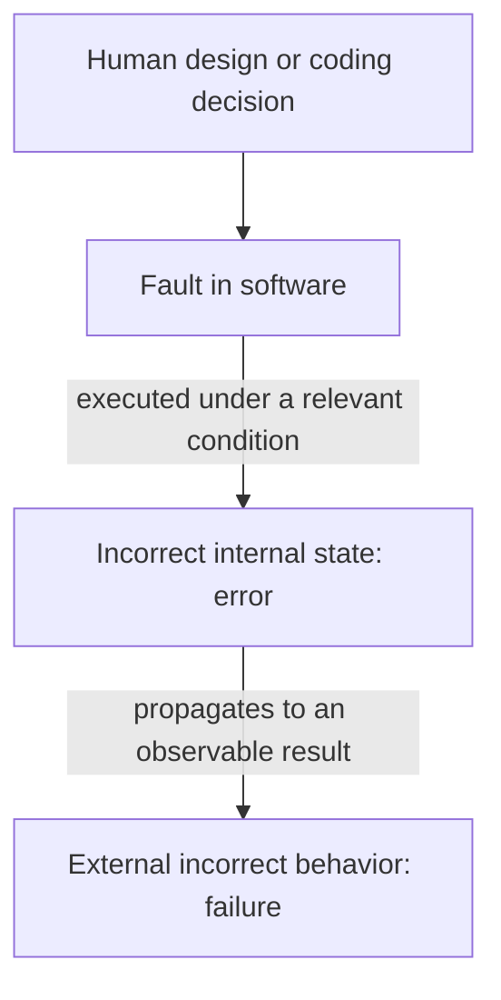

# Chapter 1 - Why Do We Test Software?

**Book:** *Introduction to Software Testing*, Second Edition  
**Authors:** Paul Ammann and Jeff Offutt  
**Book coverage:** Chapter 1, pages 1-21  
**Roadmap:** Improved 22-Week Roadmap, Week 1  
**Recommended study time:** Three sessions of 60-90 minutes

---

## How to use this lesson

- **Session 1 - Concepts:** Sections 1-7 and the quick understanding check.
- **Session 2 - Reasoning:** Sections 8-10 and the guided practice.
- **Session 3 - Application:** Sections 11-15, the independent task, and the mastery check.

Do not treat the lesson as reading only. Write your answers before comparing or discussing them.

---

## 0. Week 1 prerequisite diagnostic

Chapter 1 does not require advanced mathematics or testing knowledge. The following diagnostic identifies bridge lessons that may be needed later.

Rate each area as **Secure**, **Developing**, or **Weak**.

| Area | Quick self-check | Rating |
| --- | --- | --- |
| Java foundations | Can I trace a method containing parameters, a return value, a condition, a loop, and an exception? |  |
| Unit-testing foundations | Can I distinguish setup, input, expected result, actual result, assertion, and cleanup? |  |
| Sets | Can I explain membership, subset, union, intersection, and the empty set? |  |
| Basic combinatorics | Can I count the combinations produced by several independent choices? |  |
| Directed graphs | Can I identify nodes, directed edges, paths, and cycles? |  |
| Boolean logic | Can I evaluate expressions containing AND, OR, and NOT using a truth table? |  |
| Grammar notation | Can I recognize terminals, nonterminals, and production rules? |  |

**Interpretation**

- **Secure:** No bridge lesson is currently required.
- **Developing:** Complete a short review before the relevant chapter.
- **Weak:** Complete a bridge lesson and practice exercise before the relevant chapter.

For Chapter 1, you only need to trace a small method and compare expected behavior with actual behavior.

---

## 1. Chapter purpose

Software controls systems that people and organizations depend on. When it behaves incorrectly, the consequences can range from inconvenience and financial loss to security problems and loss of life. Testing is therefore not an optional final activity; it is a primary way to evaluate software during development.

This chapter establishes the language needed for the rest of the book. In particular, it separates:

- the defect written into the software;
- the incorrect condition produced while the software runs; and
- the incorrect behavior visible outside the software.

It also replaces two weak ideas - "testing proves correctness" and "testing is only debugging" - with a more useful goal: **testing helps reduce the risk of using software and helps teams build higher-quality software**.

### Connection to later chapters

Chapter 1 explains *why* disciplined testing is necessary. Chapter 2 will explain *how* the book organizes systematic test design through Model-Driven Test Design (MDTD).

The fault-error-failure chain also prepares us for the RIPR model in Chapter 2. This is only a preview: a test must do more than execute faulty code; the resulting incorrect state must eventually become observable.

---

## 2. Learning outcomes

After completing this chapter, you should be able to:

1. Distinguish a software fault, error state, and failure.
2. Explain what a program state contains.
3. Explain why executing a fault does not always produce a visible failure.
4. Distinguish verification from validation.
5. Distinguish testing from debugging.
6. Describe Beizer's five testing maturity levels used in the chapter.
7. Explain why testing reduces risk rather than proving perfection.
8. Explain why late discovery and repair of faults can be expensive.
9. Write a precise test objective for a feature.

---

## 3. Key vocabulary

### 3.1 Software fault

**Precise meaning:** A static defect in the software artifact.

**Plain language:** Something is wrong in what was written or designed. It exists even when the program is not running.

**Example:** A booking condition uses `availableRooms >= 0` when the requirement needs `availableRooms > 0`.

**Do not confuse it with:** The wrong result seen by a user. That visible result is a failure.

### 3.2 Software error

**Precise meaning:** An incorrect internal program state caused by a fault.

**Plain language:** While the program runs, its internal data or execution position differs from what it should be.

**Example:** When no rooms are available, the program stores `canBook = true`.

**Do not confuse it with:** A human mistake or an error message. In this chapter, *error* has the specific meaning of an incorrect internal state.

### 3.3 Software failure

**Precise meaning:** Externally observable behavior that is incorrect relative to the requirements or another description of expected behavior.

**Plain language:** A user, tester, or another system can observe the software doing the wrong thing.

**Example:** The API returns `201 Created` and confirms a reservation when the hotel has no available room.

**Do not confuse it with:** The faulty line of code. A failure is behavior; a fault is a defect in the software.

### 3.4 Program state

During execution, the program state consists of:

- the current values of all live variables; and
- the current execution location, represented by the program counter (PC).

The PC matters because two executions may contain similar variable values but be at different statements and therefore be different states.

### 3.5 Verification

**Precise meaning:** Determining whether the product of one development phase satisfies the requirements established during the previous phase.

**Plain language:** Does the implementation or design match its stated specification?

**Example:** The specification says a confirmed booking must receive a unique reference. Verification checks whether the implemented system does that.

### 3.6 Validation

**Precise meaning:** Evaluating the completed software to determine whether it supports its intended use.

**Plain language:** Does the delivered software actually meet the users' real needs?

**Example:** The software implements every written booking rule, but hotel employees cannot complete a normal reservation efficiently. It may satisfy verification while failing validation.

### 3.7 Testing

Testing evaluates software by designing and executing checks intended to provide information about its behavior and quality. In the chapter's mature view, its purpose is to reduce risk and improve software quality.

### 3.8 Debugging

Debugging begins after a problem is observed or suspected. It investigates the cause, locates the fault, and supports repairing it.

| Testing | Debugging |
| --- | --- |
| Designs conditions that evaluate software behavior | Investigates why incorrect behavior occurred |
| Can reveal a failure | Locates and repairs the responsible fault |
| Asks, "Under what conditions does the software behave incorrectly?" | Asks, "Where is the defect and how should it be fixed?" |
| Provides evidence about quality and risk | Changes the implementation to remove a cause |

Testing and debugging support each other, but they are not the same activity.

### 3.9 Test objective

A test objective states the fact, behavior, rule, or risk that a test is intended to evaluate.

**Weak:** Test the booking API.

**Precise:** Determine whether the booking service rejects a request when no room is available and avoids creating a reservation record.

---

## 4. The fault-error-failure chain



This is not an automatic chain.

1. A fault may not be executed by a particular test.
2. A fault may be executed without producing an incorrect state for that input.
3. An incorrect state may occur but later be overwritten, masked, or otherwise fail to reach the output.
4. A visible failure occurs only when the incorrect state affects observable behavior.

This explains a central lesson: **executing faulty code is not sufficient evidence that a test will reveal the fault**.

### Book example: counting zeroes

The book presents a method intended to count zeroes in an integer array. Its loop begins at index `1` instead of index `0`.

- With `[2, 7, 0]`, the execution starts in an incorrect state because index `0` was skipped. However, the skipped value is not zero, so the returned count is accidentally correct.
- With `[0, 7, 2]`, the same fault causes the first zero to be skipped, and the returned count is incorrect.

The first execution contains an error state without an observable failure. The second contains an error state that propagates to a failure.

---

## 5. Section 1.1 - When software goes bad

The chapter uses major failures to show why precise thinking about testing matters.

| Case discussed in the book | Central testing lesson |
| --- | --- |
| Mars lander | A mismatch between English and metric units created an expensive integration failure. Interfaces and assumptions between components must be tested. |
| Therac-25 | Software faults in a safety-critical system can contribute to death. Consequence changes how much testing evidence is needed. |
| Ariane 5 | Software that was suitable in one operational context was reused in a different context without adequate reanalysis and system testing. Previous success does not guarantee correctness in a new environment. |
| Pentium division fault | A fault difficult to encounter during broad system testing could have been easier to expose with focused unit-level criteria. Testing at the correct level matters. |
| Northeast blackout | Failure in an alarm system prevented operators from understanding a developing physical problem, contributing to cascading consequences. |

The chapter's point is not to memorize the incidents. The important pattern is:

> Software is used in important, complex, and widely connected systems; therefore weak testing decisions can produce consequences far beyond a single faulty function.

The chapter also emphasizes that faults do not appear spontaneously. They enter software through human decisions made in requirements, design, implementation, integration, or maintenance. No process can guarantee that humans will never make a mistake, so testing cannot promise fault-free software.

---

## 6. Section 1.2 - Goals of testing software

### 6.1 Verification versus validation

Consider this requirement:

> A hotel booking allows at most eight guests.

Suppose the implementation correctly allows eight guests and rejects nine.

- **Verification:** Passes, because the implementation follows the written requirement.
- **Validation:** Could still fail if the hotels using the product never allow more than four guests in any room. The written requirement may not represent intended use.

This shows why the two activities are different. Verification can reveal a mismatch between an artifact and its specification. Validation can reveal that the specification itself does not represent what users need.

The familiar questions "Are we building the product right?" and "Are we building the right product?" are useful memory aids, but the more precise definitions above should be used in exams and technical writing.

### 6.2 Testing maturity levels

The chapter adapts Beizer's levels according to the organization's goal for testing.

| Level | Goal or mindset | Main weakness or strength |
| ---: | --- | --- |
| 0 | Testing and debugging are treated as the same activity. | Incorrect behavior is not separated from the defect that caused it. |
| 1 | Testing tries to show that the software is correct. | For nontrivial software, tests cannot demonstrate complete correctness; passing tests may simply be weak tests. |
| 2 | Testing tries to show that the software does not work. | Finding failures is useful, but the goal can make testers and developers adversaries and still gives no reliable stopping rule. |
| 3 | Testing reduces the risk of using the software. | The team shares a realistic goal: gather evidence and reduce important risks, while accepting that risk cannot become zero. |
| 4 | Testing is a mental discipline that helps professionals produce higher-quality software. | Testing knowledge influences requirements, design, coding, and learning across the team, not only test execution. |

These levels describe testing mindsets, not job titles or the number of automated tests a team owns.

### 6.3 Why testing does not prove perfection

Suppose 200 tests pass. We may conclude that the observed executions satisfied their expected results. We cannot conclude that:

- every possible input was tested;
- every relevant sequence of operations was tested;
- every environment and configuration was tested;
- the tests contained correct expectations;
- no fault remains in untested or weakly tested behavior.

Passing tests provide evidence. The strength of the conclusion depends on how those tests were designed and which risks they address.

### 6.4 Why the goal is risk reduction

Using software always involves some uncertainty. A failure may still occur, and its consequence may be small or catastrophic. Level 3 thinking asks the team to reduce meaningful risk, not to make an impossible guarantee.

**Additional explanation - practical risk framing**

A simple planning approach is to consider both:

- **Likelihood:** How plausible is the failure?
- **Impact:** How serious would its consequences be?

This likelihood-impact framing is a practical aid added by the lesson; it is not presented as a formula from Chapter 1.

### 6.5 Why late faults cost more

The chapter's Figure 1.1 reports data in which finding and correcting a fault had an approximate relative cost of:

| Detection phase | Relative cost in the reported analysis |
| --- | ---: |
| Requirements, design, or unit testing | 1 unit |
| Integration testing | 5 units |
| System testing | 10 units |
| After deployment | 50 units |

These numbers describe the analysis reported by the book; they should not be treated as a universal constant for every project.

The general reason remains strong. A fault discovered late may require changes to dependent designs, code, databases, interfaces, documentation, deployed data, user workflows, and operational procedures. A production failure can also create support costs, refunds, legal exposure, security incidents, or loss of trust.

---

## 7. Quick understanding check

Classify each item as a **fault**, **error**, or **failure**.

1. A comparison operator in the source code is incorrect.
2. During execution, `canBook` becomes `true` even though no room is available.
3. The customer receives a confirmation for an unavailable room.
4. A loop starts at the wrong array index.
5. The returned number of available rooms is incorrect.

Then answer:

6. Can a fault exist before the program runs? Why?
7. Can an error occur without a failure? Give one reason.
8. Does a passing test prove the absence of faults? Why not?

---

## 8. Complete worked example - hotel booking

### 8.1 Expected behavior

A booking may be confirmed only when at least one room is available.

### 8.2 Faulty decision

```java
boolean canBook = availableRooms >= 0;
```

The correct boundary should require a value greater than zero.

### 8.3 Test input

```text
availableRooms = 0
```

### 8.4 Reasoning step by step

**Step 1 - Identify the fault**

The operator `>=` is a static defect. It accepts zero when the requirement says at least one room must exist.

**Step 2 - Execute the relevant condition**

The input `availableRooms = 0` reaches the faulty expression and distinguishes the faulty condition from the correct one:

- Faulty expression: `0 >= 0` is `true`.
- Correct expression: `0 > 0` is `false`.

**Step 3 - Identify the first incorrect state**

Immediately after the assignment:

```text
availableRooms = 0
canBook = true
PC = next statement after the assignment
```

The expected state has `canBook = false`. Therefore, the actual state is an error state.

**Step 4 - Explain propagation**

If the service uses `canBook` to create the reservation, the incorrect value affects the database write and API response.

**Step 5 - Identify the failure**

The service creates a reservation and sends a confirmation despite having zero available rooms. This is externally observable incorrect behavior.

### 8.5 Full chain

| Element | Classification |
| --- | --- |
| `availableRooms >= 0` | Fault |
| `canBook = true` when `availableRooms = 0` | Error state |
| Reservation created and confirmation returned | Failure |

### 8.6 Why another test might not reveal it

With `availableRooms = 2`, both the faulty and correct expressions produce `true`. The faulty expression is executed, but it does not create an incorrect value for this input. Therefore, that test does not reveal the fault.

### 8.7 Precise test objective

Determine whether the booking service rejects a request when the number of available rooms is zero and avoids creating a reservation or returning a confirmation.

---

## 9. Guided practice

A room may hold a number of guests less than or equal to its capacity. The implementation uses:

```java
boolean fits = guestCount < roomCapacity;
```

Use this case:

```text
guestCount = 2
roomCapacity = 2
```

Complete the table.

| Question | Your answer |
| --- | --- |
| What is the expected behavior? |  |
| What is the fault? |  |
| What value does the faulty expression produce? |  |
| What value should it produce? |  |
| What is the first error state? Include the PC. |  |
| What observable failure could result? |  |
| Write one precise test objective. |  |

**Hints**

1. Compare `<` with `<=` at the boundary.
2. The error is the incorrect runtime value of `fits`, not the operator itself.
3. The failure must be behavior visible outside the internal calculation.

---

## 10. Independent practice - no solution yet

A booking request is valid only when `checkOut` is later than `checkIn`. An implementation rejects the request only when:

```java
checkOut.isBefore(checkIn)
```

Analyze the case in which `checkOut` equals `checkIn`.

Produce:

1. The expected behavior.
2. The precise fault.
3. The first error state.
4. The observable failure.
5. A test that executes the condition but does not produce an error state.
6. A precise test objective.
7. A proposed repair.

Do not request the solution until you have written all seven answers.

---

## 11. Practical application - feature risk analysis

> **Additional explanation:** The following table applies Chapter 1's risk-reduction mindset to the continuing Spring-style hotel-booking project. The specific risk table is supporting material, not a table reproduced from the book.

### Feature

**Confirm a hotel booking.**

### Main risks

| Risk | Possible consequence | Relative concern | Testing response |
| --- | --- | --- | --- |
| Confirming an unavailable room | Overbooking, refund, customer dissatisfaction | High | Test zero availability, concurrent attempts, and inventory changes before confirmation. |
| Accepting invalid dates | Zero-night or negative-duration booking, incorrect availability | High | Test equal dates, reversed dates, boundaries, and valid multi-night stays. |
| Accepting more guests than capacity | Unsafe or unusable reservation | High | Test below, equal to, and above capacity. |
| Calculating the wrong total price | Financial loss, dispute, loss of trust | High | Test number of nights, rate changes, discounts, taxes, and rounding. |
| Returning success after payment failure | Unpaid reservation or inconsistent records | High | Test rejected payments and verify that no confirmed booking remains. |
| Sending duplicate confirmations | User confusion and duplicate downstream work | Medium | Repeat and retry the same request and check idempotent behavior. |

### Primary test objective

Determine whether the service creates a confirmed booking only when dates are valid, capacity and inventory are sufficient, payment is authorized, and the stored reservation agrees with the returned confirmation.

### Example fault-error-failure chains

| Possible fault | Resulting error state | Observable failure |
| --- | --- | --- |
| Availability check accepts zero rooms. | `canBook` becomes `true` with no inventory. | An unavailable room is confirmed. |
| Date validation checks only `checkOut < checkIn`. | Equal dates are marked valid. | A zero-night booking is accepted. |
| Night calculation includes the checkout date. | `numberOfNights` is one too large. | Customer is charged for an extra night. |
| Payment failure is handled after status is committed. | Stored status remains `CONFIRMED` after rejection. | Customer sees a confirmed but unpaid reservation. |

### Consequences of failure

- Direct financial loss through incorrect charges or refunds.
- Inconsistent inventory and reservation records.
- Customer complaints and loss of trust.
- Extra operational work for hotel staff.
- Possible contractual, privacy, or security consequences depending on the affected data and process.

---

## 12. Common mistakes

1. **Calling every problem a bug.** The informal word hides whether you mean a fault, error, or failure.
2. **Calling the wrong output an error.** In this chapter's terminology, a wrong external output is a failure; the error is the incorrect internal state.
3. **Assuming fault execution guarantees failure.** The input may not create an incorrect state, or the incorrect state may not reach an observable output.
4. **Ignoring the program counter.** A complete state includes the live variable values and the current execution location.
5. **Treating verification and validation as synonyms.** Software can match a flawed specification and therefore pass verification while failing validation.
6. **Equating testing with debugging.** Testing evaluates and can reveal failures; debugging locates and repairs their causes.
7. **Claiming that all passing tests prove correctness.** Tests provide evidence only for the behaviors and conditions they cover.
8. **Treating Level 2 as the final goal.** Finding failures is valuable, but risk reduction and quality improvement provide a stronger shared purpose.
9. **Using late-cost multipliers as universal constants.** The book reports them from a particular analysis; the durable lesson is that downstream change and production consequences often make late repair more expensive.
10. **Writing vague objectives.** "Test bookings" does not identify the rule, condition, or risk being evaluated.

---

## 13. Knowledge check

### A. Terminology - five questions

1. Define a software fault without using the words *error* or *failure*.
2. What makes a program state an error state?
3. What two types of information form a complete program state?
4. Distinguish verification from validation using one booking example.
5. Distinguish testing from debugging.

### B. Application - three questions

6. A method contains a wrong operator, but a test returns the expected result. Explain two different ways this can happen.
7. A booking system follows its written requirements, but hotel employees cannot use it to complete their real workflow. Which activity is most likely to reveal the problem, and why?
8. A team says, "Our job is to break the developers' code." Which maturity level best matches this goal? What change would move the team toward Level 3?

### C. Analysis - one question

9. A test suite executes with no failures. Explain exactly what this result supports and at least four things it does not prove.

### D. Teach it back

10. In your own words, teach a junior developer the fault-error-failure distinction using one example that is not used elsewhere in this lesson.

---

## 14. Chapter artifact

This file is the Week 1 artifact: `chapter-01-foundations.md`.

Before marking it complete, add your own answers to:

- the prerequisite diagnostic;
- the guided practice;
- the independent practice;
- the knowledge check; and
- the reflection below.

### Reflection

```text
My current testing maturity level:

Evidence for this classification:

One habit I will change after Chapter 1:

The concept I still find confusing:
```

---

## 15. One-page revision sheet

### Essential terms

| Term | Revision definition |
| --- | --- |
| Fault | Static defect in software. |
| Error | Incorrect internal program state caused by a fault. |
| Failure | Observable behavior that differs from expected behavior. |
| Program state | Values of live variables plus the program counter. |
| Verification | Checks an artifact against requirements from the preceding phase. |
| Validation | Checks completed software against intended use. |
| Testing | Evaluates software to provide evidence, reduce risk, and improve quality. |
| Debugging | Locates, understands, and repairs the cause of a problem. |

### Central chain

```text
Fault --execution under a relevant condition--> Error
Error --propagation to an observable result--> Failure
```

Neither arrow is guaranteed for every test.

### Maturity levels

```text
0: Testing = debugging
1: Show correctness
2: Show that software does not work
3: Reduce risk
4: Use testing as a quality discipline
```

### Small example

```text
Requirement: booking needs availableRooms > 0
Fault:       implementation uses availableRooms >= 0
Error:       canBook = true when availableRooms = 0
Failure:     unavailable room is confirmed
```

### Remember

- Testing can show failures, but passing tests do not prove the absence of faults.
- Verification can pass while validation fails.
- The earlier a fault is removed, the fewer dependent artifacts and users it can affect.
- Every test should have a reason: state the behavior or risk it evaluates.

### Connection forward

Chapter 2 will turn this motivation into a systematic process: software artifact, model, coverage criterion, test requirements, test values, executable tests, execution, and evaluation.

---

## Mastery check

Do not move to Chapter 2 until you can complete all of the following without notes:

- [ ] Correctly classify at least 8 of 10 new fault-error-failure examples.
- [ ] Describe one complete error state, including live variables and the program counter.
- [ ] Give an example where a fault is executed but no failure occurs.
- [ ] Explain verification versus validation using your own example.
- [ ] Explain testing versus debugging without treating them as job roles.
- [ ] State and explain testing maturity Levels 0-4.
- [ ] Explain why testing reduces but cannot eliminate risk.
- [ ] Write a precise test objective for a new booking rule.
- [ ] Complete the guided and independent practices.
- [ ] Complete the knowledge check and teach-back explanation.

**Mastery decision:**

- **Ready:** All items are complete and the classifications are precise.
- **Review:** One or two items are uncertain; revisit only the relevant section.
- **Bridge required:** Core terms are still mixed up; repeat the worked example with a different feature before progressing.

---

## Source boundary

The foundational definitions, the fault-error-failure model, the program-state discussion, the verification-validation distinction, the testing maturity levels, the reported late-testing cost pattern, and the historical examples are based on Chapter 1 of Ammann and Offutt's *Introduction to Software Testing*, Second Edition.

Material explicitly marked **Additional explanation**, including the practical likelihood-impact framing and the hotel-booking risk table, was added to support application of the chapter. It should not be attributed directly to the authors.
